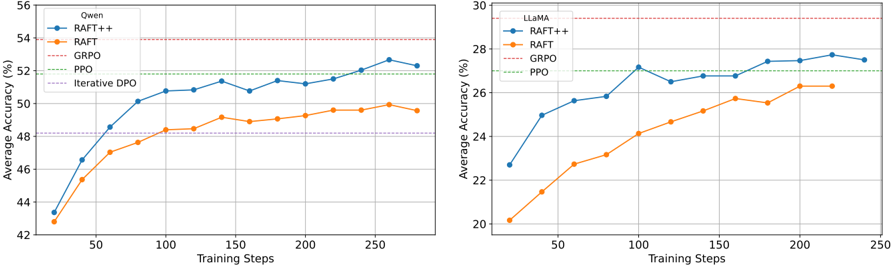
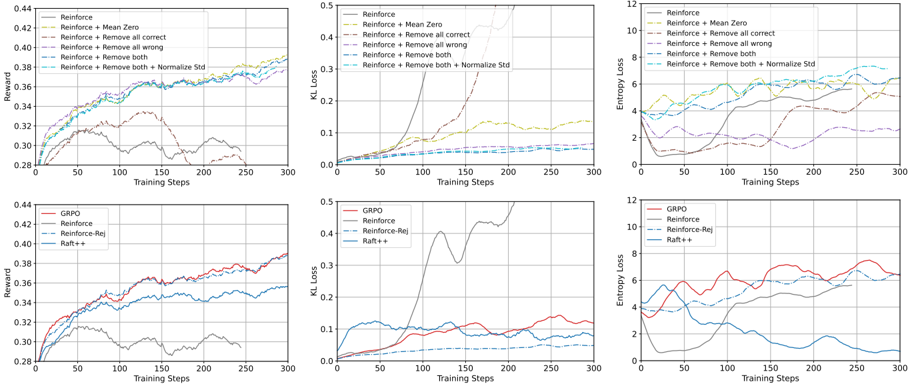

# raft_reinforce_rej — A Minimalist Approach to LLM Reasoning: from Rejection Sampling to Reinforce (RAFT / RAFT++ / Reinforce-rej)

- **arXiv/链接**: arXiv:2504.11343 (v2, 2025-06-12); https://arxiv.org/abs/2504.11343
- **机构/作者**: Salesforce AI Research + UIUC。Wei Xiong, Jiarui Yao, Yuhui Xu, Bo Pang, Lei Wang, Doyen Sahoo, Junnan Li, Nan Jiang, Tong Zhang, Caiming Xiong, Hanze Dong(共同通讯)。
- **发表/时间**: arXiv 预印本,2025-04(v2 2025-06)。
- **主题/相关性**: T3。从拒绝采样(RAFT,本质是在自生成正例上的 SFT)到 Reinforce/GRPO 的统一最小化视角,剖析当前 RL 实践成功的关键因子。属 GFT-class / SFT-RL 统一谱系的关键分析性工作。

## 关键图示

**① Motivation / 对比图**

*Figure 1: The learning dynamics of RAFT and RAFT++, initialized from Qwen2.5-Math-7B-base (left) and LLaMA-3.2-3B-instruct (right). The y-axis is the average@16 accuracy, that is further averaged on MATH500, Minerva Math, and Olympiad Bench. We also plot the best model of GRPO, PPO, and Iterative DP*

**② 方法 / 架构图**

*Figure 4: Ablation study on the components of GRPO and Reinforce-type algorithms with LLaMA-3.2-3Binstruct. We compare GRPO with other Reinforce-based variants to isolate the effects of removing incorrect samples, correct samples, and applying normalization. Removing incorrect samples ('Remove all w*

## 1. 开源代码链接
https://github.com/RLHFlow/Minimal-RL 。

## 2. 使用框架
veRL(仓库内置 verl 源码,入口 `verl.trainer.main_ppo`)。FSDP + vLLM。提供脚本 `scripts/run_raft.sh`、`run_raftpp.sh`、`run_reinforce_rej.sh`、`run_grpo.sh`、`run_ppo.sh`(无独立 vanilla `run_reinforce.sh`;vanilla RAFT/Reinforce 通过 `policy_loss=vanilla` 切换,RAFT++ 用 `policy_loss=plusplus`)。〔已核-脚本目录〕

## 3. 研究背景
RLVR(可验证奖励的 RL)已成为提升 LLM 数学推理的主流。GRPO 因 DeepSeek-R1 的成功被广泛采用,但其算法细节缺乏文档,且不清楚其优势究竟来自算法本身还是延续性惯例。作者系统重审一组算法以找出当前 RL 实践成功的关键因子。

## 4. 当前存在的问题

- GRPO 相对 vanilla Reinforce 的增益来源不明(奖励归一化 vs 隐式过滤)。
- 仅用正例训练(RAFT/拒绝采样)虽收敛快但会过早熵坍缩、性能停滞。
- 对所有采样回答全错的 prompt 训练会显著损害 on-policy 方法性能。

## 5. Motivation
以"从拒绝采样到 Reinforce"的连续谱系作为最小化基线,逐项消融,搞清楚:正/负样本各自的作用、prompt 过滤的作用、奖励归一化的作用,从而提出一个简洁却接近 GRPO 的新变体。

## 6. 主要方法
重审并实现三类算法 + 一个新变体(advantage 估计在 `verl/trainer/ppo/core_algos.py` 中确认):

1. **RAFT(拒绝采样 = 在正例上的 SFT)** —— `compute_raft_outcome_advantage`:对每条回答取 outcome reward 之和,**将 <0 的分数截断为 0**(\(\mathrm{scores}[\mathrm{scores}<0]=0\)),即只对正确/正奖励样本产生梯度。配 `policy_loss='vanilla'`(`compute_policy_loss_vanilla`),其 \(\mathrm{pg\_losses1} = -\,\mathrm{advantages}\cdot\log\mathrm{prob}\),**无重要性采样比、无 clip**,本质是对正例的加权对数似然(SFT)。

2. **RAFT++** —— 在 vanilla RAFT 基础上加入 **重要性采样 + clipping**(`policy_loss='plusplus'` → `compute_policy_loss`,PPO 风格 \(\mathrm{ratio} = \pi_\theta/\pi_{\theta_{\mathrm{old}}}\),带 dual-clip)。损失:\(L_{\mathrm{Reinforce}}(\theta) = \frac{1}{|D|}\sum \min\!\big(\mathrm{ratio}\cdot\hat{A},\ \mathrm{clip}(\mathrm{ratio})\cdot\hat{A}\big)\)。

3. **Vanilla Reinforce / GRPO** —— Reinforce 为去掉 critic 的 PPO 简化版;GRPO(`compute_grpo_outcome_advantage`)对每 prompt 采 n 条回答,用组内 mean/std 归一化得相对优势。

4. **新变体 Reinforce-rej** —— `compute_reinforce_rej_outcome_advantage`:对每个 prompt(按 `index` 分组)计算组内分数标准差,**若 std>0 保留该组的优势信号,若 std==0(即全对或全错)则把优势置 0**(`scores[i]-scores[i]`),即选择性过滤掉"全对或全错"的 prompt。

## 7. 实验数据集

- 训练:NuminaMath / MATH(脚本默认 `data=numina_math`,也支持 `math`;数据预处理脚本在 `scripts/` 下:`math_dataset.py`、`numina_math.py`、`gsm8k.py`)。
- Backbone:Qwen2.5-Math-7B-base 与 LLaMA-3.2-3B-instruct(用各自默认 chat template;脚本示例 Qwen2.5-Math-1.5B,n=4,lr=1e-6,use_kl_loss=True)。
- 评测:MATH500、Minerva Math、Olympiad Bench(报告 average pass@16 等;不含 AIME2024,因仅 30 题趋势不稳)。
- 结果(Qwen2.5-Math-7B-base):Base 23.6 → RAFT 52.3 → RAFT++ 56.1(三基准均值);RAFT++ 早期收敛更快、接近 GRPO/PPO;Reinforce-rej 终态性能与 GRPO 相当且 KL 效率更优。

## 8. 怎么做的(训练/数据/流程)

1. 对每个 prompt 用当前策略采样 n 条回答,verifier 给可验证奖励。
2. 按所选 `adv_estimator` 计算优势:RAFT 截断负值→只学正例;Reinforce-rej 过滤全对/全错 prompt;GRPO 组内归一化。
3. actor 用对应 `policy_loss`:`vanilla`(无 IS/clip,等价正例 SFT)或 `plusplus`(PPO 式 IS+clip)更新;可选 KL loss。
4. 通过消融对比得出主要结论:GRPO 优于 Reinforce 主要来自对"全错 prompt"的隐式过滤,而非 mean/std 奖励归一化;仅正例训练加速收敛但致熵坍缩,负样本对维持探索/防分布坍缩至关重要;由此 Reinforce-rej 兼顾性能与 KL 效率。
