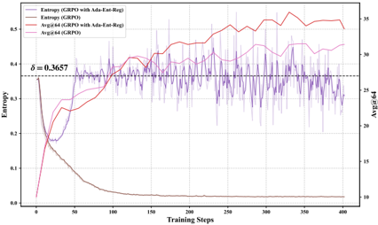
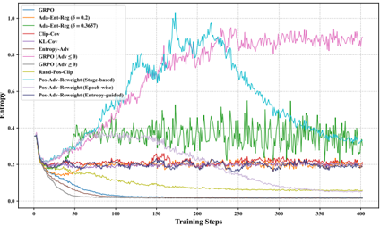

# revisit_entropy — Revisiting Entropy in Reinforcement Learning for Large Reasoning Models

- **arXiv/链接**: https://arxiv.org/abs/2511.05993 (v3, 2026-04-19；v1 2025-11-08)
- **机构/作者**: Renren Jin、Pengzhi Gao、Yuqi Ren 等；天津大学 TJUNLP Lab、天津师范大学、独立研究者。通讯：Deyi Xiong（熊德意）
- **发表/时间**: 2025-11（arXiv），cs.CL
- **主题/相关性**: RLVR 中熵动态的系统性实证研究 + 一个轻量熵调控方法。属于"熵机制/熵崩溃"研究线，对理解 RL 阶段探索-利用权衡有参考意义；与 OPD 关联间接。

## 关键图示

**① Motivation / 对比图**

*Figure 1: Evolution of LLM entropy and Avg@64 performance on AIME 2024 during RLVR training. 'AdaEnt-Reg' denotes adaptive entropy regularization.*

**② 方法 / 架构图**

*Figure 5: Evolution of the entropy of LLMs during RLVR training under different methods. 'Ada-Ent-Reg' denotes Adaptive Entropy Regularization.*

## 1. 开源代码链接
https://github.com/cordercorder/EntropyRL （已 clone，约 7.8MB；以 verl 为底，`train_scripts/` 提供 ada_ent_reg.sh、clip_cov.sh、kl_cov.sh、entropy_adv.sh、pos_adv_reweight.sh、rand_pos_clip.sh 及 reward 脚本）。代码真实可用；README 说明 Clip-Higher、Adv≤0/≥0 等基线只需对 veRL 做小改、未单独提供脚本。

## 2. 使用框架
veRL（Sheng et al. 2025），GRPO 训练。

## 3. 研究背景
RLVR 是提升 LLM 推理能力的主流范式，但训练中策略熵常崩溃，导致过早收敛到次优局部最优、阻碍进一步提升。已有缓解方法（熵正则、Clip-Higher、Clip-Cov/KL-Cov、CE-GPPO、80/20 等）众多，但对 RLVR 中熵本身缺乏系统研究。

## 4. 当前存在的问题
三个未被充分探讨的问题：(1) RLVR 训练中 LLM 熵与性能如何关联？(2) 什么因素从理论与实证上支配熵动态？(3) 如何有效调控熵以提升性能？

## 5. Motivation
通过大规模实证回答上述三问，并基于"正优势 token 是熵崩溃主因"这一理论+实证结论，设计可精确调控熵的轻量方法。

## 6. 主要方法
核心实证发现：

- 熵与响应多样性强正相关；训练中 in-domain prompt 熵下降快于 out-of-domain；prompt 熵与准确率仅弱相关。
- 性能可在熵不被牺牲的情况下持续提升（自适应熵正则把熵维持在训练前水平时，AIME24 准确率反而更高）。
- 熵与性能相关性高度依赖任务与指标（如仅用数学数据训练时，LiveCodeBench 的 Avg@64 与熵强负相关，其他基准弱相关）。
- 熵崩溃伴随 miscalibration（过度自信）；崩溃越重、校准越差。
- 三个影响熵动态的因素：裁剪阈值、off-policy 更新次数、训练数据多样性（约 600 条样本可达约 17k 样本的性能）。
- 理论+实证证明：正优势 token 是熵崩溃主驱动。
方法 Positive-Advantage Reweighting（Pos-Adv-Reweight）：用超参 λ 动态调节正优势 token 的损失权重，三个变体——(a) Stage-based：前半段 λ=0（只用非正优势 token），后半段 λ 从 0 线性升到 1；(b) Epoch-wise：λ 按 epoch 线性 (e−1)/(E−1)；(c) Entropy-guided：当熵>阈值 δ 时 λ+Δ（抑熵）、否则 λ−Δ（增熵），把熵稳在 δ 附近（δ=0.2、Δ=0.05、λ0=0）。

## 7. 实验数据集

- 训练：DAPO-Math-17K，Qwen2.5-Math-7B + GRPO。
- in-domain 评测：AIME24/25、MATH500、AMC2023、Minerva Math；out-of-domain：LiveCodeBench（代码）、IF-Eval（指令遵循）。指标 Avg@64 / Pass@64。

## 8. 怎么做的(训练/数据/流程)
veRL 上用 GRPO 训 Qwen2.5-Math-7B（DAPO-Math-17K，主实验）。对比 GRPO、Clip-Lower、Clip-Free、Ada-Ent-Reg(δ=0.2/0.3657)、Adv≤0、Rand-Pos-Clip 及三个 Pos-Adv-Reweight 变体。**另在 Llama-3.1-8B-Instruct 上做泛化验证（同样 DAPO-Math-17K，附录 F）**：熵崩溃/校准/正优势 token 主导等核心发现与 Pos-Adv-Reweight(Entropy-guided) 的有效性在该骨干上同样成立〔已核-论文附录 F〕。
结果：仅在 Adv≤0 上训练虽能抑制熵崩溃但平均 Avg@64 偏低；Stage-based 与 Epoch-wise 在 7 基准中的 5 个（AIME24/25、MATH500、Minerva、IF-Eval）超 GRPO，平均与其他熵正则方法相当；三个变体平均 Avg@64 均超 Clip-Higher，其中 Entropy-guided 在 7 个中的 6 个上超 Clip-Higher 且能精确把熵控在目标值。
**批判性评价**：本文最大价值在系统性实证与 ablation，方法本身（按优势符号重加权损失）是渐进式改良，与 Clip-Cov/KL-Cov、80/20 等"针对高协方差/正优势 token 限更新"思路同源，性能增益有限（多与现有熵正则"相当"，而非显著超越），且训练集单一（仅 DAPO-Math-17K）、骨干覆盖也有限（主验 Qwen2.5-Math-7B，附录补充 Llama-3.1-8B-Instruct 泛化）。"熵不一定是性能可靠代理"的结论（相关性任务依赖）是有用的负面/澄清性结论。
