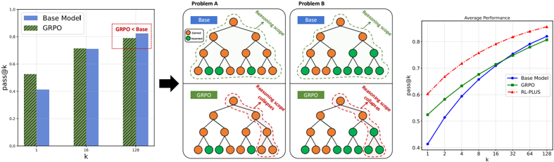
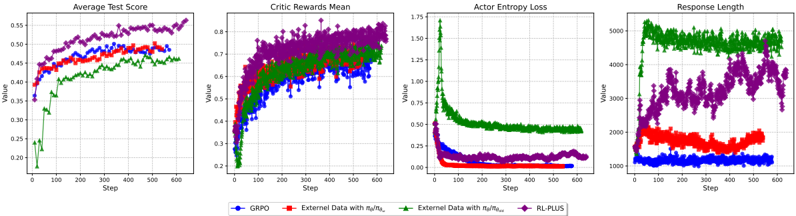

# rl_plus — RL-PLUS: Countering Capability Boundary Collapse of LLMs in Reinforcement Learning with Hybrid-policy Optimization

> **一句话重点 (TL;DR)**：针对"纯 on-policy RLVR 反而收窄基座可解问题集（capability boundary collapse）"现象，RL-PLUS 用 Multiple Importance Sampling 稳定吸收外部 off-policy 数据 + focal-style 探索优势放大低概率正确路径，并去掉 clip，使 Pass@k 突破基座天花板。

**元信息**：arXiv 2508.00222（v5, 2026-04-15；标注 Preprint July 2025）｜ 北京大学 / 阿里通义实验室 / University of Alberta（Yihong Dong、Xue Jiang、Ge Li、Zhi Jin、Yongbin Li 等，一作实习于通义）｜ Preprint ｜ 主题 混合策略 RLVR / 相关性较高（外部+教师轨迹引导、低概率正确路径利用，与 TSRD 的 path-recovery 同源）｜ 代码 https://github.com/YihongDong/RL-PLUS（已克隆，含 `rl_plus/`{deepscaler,verl,scripts,setup.py}、`exp_scripts/`、`eval_scripts/`、`data/`）｜ 框架 VeRL + DeepScaleR

## 关键图示

**① Motivation / 对比图**

*(a) Collapse problem of capability boundaries in LLMs after RLVR training. (b) Benefits of our RL-PLUS.*

**② 方法 / 架构图**

*Figure 2: Training dynamics of RL-PLUS and other baselines.*

## 1. 相关工作与进展
RLVR（OpenAI o1、DeepSeek-R1、Kimi 等）通过可验证奖励（数学答案正确、代码单测通过）驱动 LLM 延展 CoT、自发出现反思与探索行为，被视为通向更强 AI 的有希望路径。论文从两条线定位自身：(1) on-policy RLVR（GRPO 及其改进，如 PRIME-Zero 用隐式过程奖励）；(2) 引入外部知识以突破纯 RL 的知识上限的方法（SFT→RL、GRPO w/ SFT Loss，以及并发工作 LUFFY、ReLIFT）。

## 2. 现有工作存在的问题

- 多篇工作（Havrilla 2024、Shao 2024、Yue 2025a）指出现行 RLVR 不能让模型获得**新**推理能力，只是复用基座已有模式：Pass@1 升、Pass@128 反而低于基座，说明可解问题集被收窄（capability boundary collapse）。
- 根因：解空间巨大 + 奖励稀疏，长链推理中单步出错即清零整条轨迹奖励，模型被迫做"向内利用（inward exploitation）"而非"向外探索（outward exploration）"。
- 混合 SFT-RL 方案各有缺陷：顺序 SFT→RL 易遗忘；"GRPO w/ SFT Loss"简单相加反而掉点。
- 用 IS 吸收外部数据存在两难：on-policy 代理（分母用 πθold）有系统偏差（Lemma A.5）；理论正确的 off-policy 权重 πθ/πω 有支撑失配（A.6）与策略发散时的高方差（A.7），且 πω 通常未知不可直接算。

## 3. Motivation
以"学而不思则罔，思而不学则殆"作隐喻：当前 RLVR 是"思而不学"（只想不学外部知识），SFT 是"学而不思"（只模仿不内化、遇新题脆弱）。需要一种既能稳定从外部 off-policy 数据"学"、又能显式激励"思"出低概率但正确推理路径的混合策略方法，从而真正扩展能力边界。

## 4. 主要灵感 / 核心直觉

- **混合策略视角**：把外部样本看作来自 πθold 与外部策略 πω 的**混合**，用 Multiple Importance Sampling 而非单一 IS，使分母中的 πθold 充当"方差护栏"——即使 πω 很差，比值也有界（Theorem 3.1：只要行为池中存在一个≈πθ 的策略，方差就低）。
- **focal loss 直觉**：新知识藏在模型自认低概率的正确 token 上；借 focal loss 思想，对低概率正确 token 加大优势权重，迫使模型关注被忽视区域。
- **去 clip**：clip 会压制高信息量、低概率事件的梯度，正是要吸收的新知识，故移除。

## 5. 主要解决思路(一段话讲清核心)
在 RLVR 训练中同时混入内部 on-policy rollout（Do，用标准 PG）与静态外部数据（De）。对 De，用 token 级 MIS 比 r^m = 2πθ / (πω + πθold) 校正分布失配，其中未知 πω 用 Bayes 最优估计 ½πθold + ½U（U 为均匀分布，Theorem 3.2）；再乘以 focal-style 探索优势 C = (1−detach(πθ(e_t)))^γ 放大低概率正确 token 的信号。复合目标（Eq.7）= 内部利用项（标准 PG）+ 外部探索项（MIS·探索优势），且全程**不做 clip**。

## 6. 方法详解(通俗、分步骤)

1. **MIS 比（Eq.4）**：r^m_{i,t} = 2πθ(e_{i,t}) / [πω(e_{i,t}) + πθold(e_{i,t})]。把外部 token 当作混合策略产物，分母的 πθold（被刻意保持接近 πθ）使比值有界，把"坏代理/支撑失配"的爆炸性偏差换成有界的可控失真（Remarks A.8/A.9）。
2. **估计 πω（Theorem 3.2）**：在"具体代理 πθold"与"非信息均匀策略 U=1/V"之间按无差别原则各赋 ½ 先验，最小化 Bayes 风险得贝叶斯模型平均 π̂ω = ½πθold + ½U。
3. **探索优势（Eq.5–6）**：A^c_{i,t} = 组内标准化优势 (R_i − mean)/std · C_{i,t}，其中 C_{i,t} = (1−detach(πθ(e_{i,t})))^γ。正确 token 概率越低权重越大；detach 阻断梯度回传以稳训练；γ 为超参。
4. **复合目标（Eq.7）+ 去 clip**：内部项用标准 PG（稳定+精炼已有能力），外部项用 MIS×探索优势（驱动外部探索），移除 clip 让模型在遇到外部高价值信息时迈更大优化步。

## 7. 实验数据集

- 主基座 **Qwen2.5-Math-7B**（Table 1 全部方法同一基座）；额外报 Qwen2.5-Math-7B-Instruct、LLaMA-3.1-8B 验证跨模型族（Table 3 类）。
- **6 个数学推理 benchmark**：AIME 24、AIME 25、AMC、MATH-500、Minerva、OlympiadBench（SOTA 比较）。
- **6 个 OOD 任务**：编程 HumanEval / LiveCodeBench / LeetCode + 科学 QA ARC-c / GPQA-diamond / MMLU-Pro（Table 2）。
- 基线：SFT、GRPO、SFT+GRPO、GRPO w/ SFT Loss、LUFFY、ReLIFT。

## 8. 实验结果与主要发现

- Table 1：RL-PLUS 在 6 个数学 benchmark 全面 SOTA；较 "SFT+GRPO" 平均 **+5.2 分**；优于并发的 LUFFY、ReLIFT。
- 跨模型族：在 Qwen2.5-Math-7B 等多基座一致提升，GRPO 平均相对提升最高 **69.2%**；在 LLaMA-3.1-8B（GRPO 等基线表现差）上亦稳定改进。
- Table 2（OOD）：在编程与科学 QA 上一致超过 GRPO 与 SFT+GRPO；论文称 SFT 在 OOD 上常劣于 RL 类，而 RL-PLUS 同时在 in-domain 与 OOD 占优。
- Pass@k 曲线（Fig.3）：RL-PLUS 的 Pass@k 高于基座，**解决了能力边界坍塌**。
- 消融：去掉探索优势→Pass@k 上界明显下降；去掉 MIS→吸收外部数据不稳。

## 9. 结果如何支撑其主张
"突破边界坍塌"的主张直接由 Pass@k 曲线（RL-PLUS > Base，而 GRPO < Base）支撑，这是 capability boundary 的标准度量，逻辑闭合。"稳定吸收外部数据"由 MIS 消融 + 理论方差界（Thm 3.1）双重支撑。"探索低概率路径"由 focal-style 权重消融支撑。跨模型族与 OOD 结果支撑泛化性主张。

## 10. 逻辑自洽性(中性评估)
组件动机—理论—消融三者基本对齐：MIS 的方差护栏与 Bayes 估计有清晰推导（Thm 3.1/3.2 + 附录引理），探索权重有 focal loss 类比。去 clip 与"吸收低概率新知识"动机一致，且其稳定性显式依赖 MIS 分母约束，论证自洽。

## 11. 残留问题 / 局限

- πω ≈ ½πθold + ½U 的估计较粗糙；Thm 3.1 的"低方差"依赖"行为池中存在 ≈πθ 的策略"这一假设，外部数据质量差时是否仍成立缺乏针对性实证。
- 去 clip 的稳定性完全寄托于 MIS 分母，未给出 MIS 失效时的兜底分析。
- "泛化"证据主要在数学相邻的 OOD 推理任务（编程/科学 QA），未涉及真正异构域（对话、长文本生成等）。
- 外部数据 De 的来源/规模/质量对结果的敏感性〔待核：附录是否给出 De 构造细节〕。

## 12. 开源代码与框架(链接+框架+代码可得性)

- 链接：https://github.com/YihongDong/RL-PLUS（已克隆，含 README.md）。
- 框架：基于 **VeRL + DeepScaleR**；目录 `rl_plus/`（deepscaler、verl、scripts、setup.py）、`exp_scripts/`（训练）、`eval_scripts/`（评测）、`data/`。
- 可得性：训练/评测脚本与数据齐备，可复现性较好（核心改动在 advantage/IS 比与目标函数，落在 verl 训练 loop 内）。
