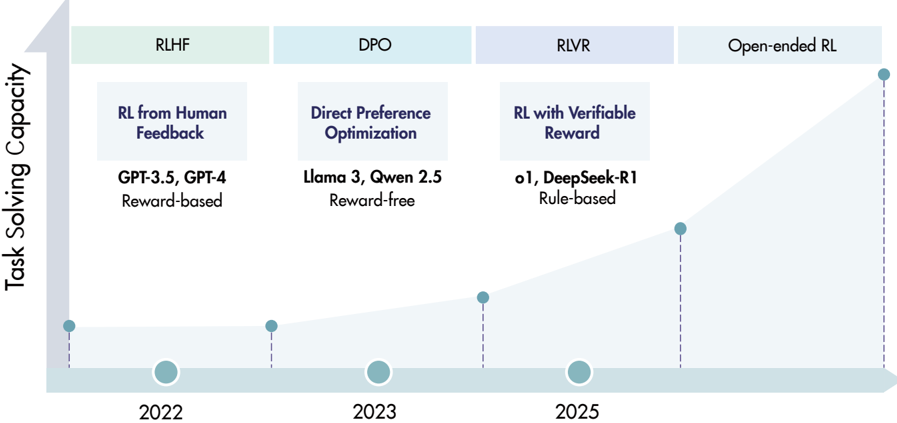
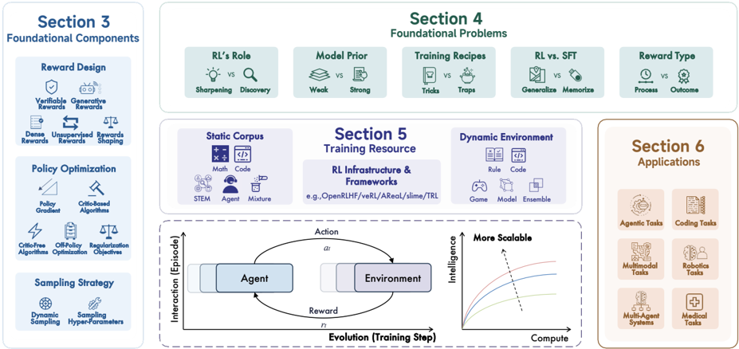

# rl_survey_lrm — A Survey of Reinforcement Learning for Large Reasoning Models

> **一句话重点 (TL;DR)**：系统综述 DeepSeek-R1 以来"RL for 大型推理模型(LRM)"的范式，提出"基础组件 / 五对开放争议 / 训练资源 / 下游应用 / 未来方向"的分类体系，明确 RLVR 是区别于 RLHF/DPO 的新 scaling 轴，并把 RL 推向 LRM/ASI 的可扩展性列为核心开放问题。

**元信息**：arXiv 2509.08827（v3, 2025-10-09/10）｜ 清华 / 上海AI Lab / 上海交大 / 北大 / 中科大 / 哈工大 / 华盛顿大学 / 华科 / UCL（40+ 作者；负责人 Kaiyan Zhang、Yuxin Zuo；通讯 Biqing Qi、Ning Ding、Bowen Zhou）｜ 2025-09（v3 2025-10）｜ 主题 T3 RL for LRM 综述 / 为本项目 RL/post-training 的全局定位与文献坐标系提供权威综述 ｜ 代码 https://github.com/TsinghuaC3I/Awesome-RL-for-LRMs（awesome-list，仅论文/资源清单，**无方法实现代码**）｜ 框架 综述仓，无独立训练框架（梳理 OpenRLHF/veRL/AReaL/slime/TRL）

> 注：本条为综述（非方法论文，paper-only），下列 12 节按"综述视角"映射填写（如"实验数据集/结果"对应综述梳理的训练资源与核心论断）。

## 关键图示

**① Motivation / 对比图**

*Figure 2 | RLHF and DPO have been the two predominant RL methodologies for human alignment in recent years. In contrast, RLVR represents an emerging trend in RL for LRMs, significantly enhancing their capacity for complex task solving. The next stage of scaling RL for LLMs remains an open question,*

**② 方法 / 架构图**

*Figure 1 | Overview of the survey. We introduce the foundational components of RL for LRMs, along with open problems, training resources, and applications. Central to this survey is a focus on large-scale interactions between language agents and environments throughout long-term evolution.*

## 1. 相关工作与进展
RL 在 AlphaGo/AlphaZero 时代已证窄而明确的奖励可驱动超人表现。LLM 时代 RL 先以 RLHF/DPO 做人类对齐（3H：helpful/honest/harmless）。近期出现新趋势 **RL for LRMs**——不止对齐行为，而是直接激励推理本身。OpenAI o1 与 DeepSeek-R1 两个里程碑证明：用**可验证奖励的 RL（RLVR）**（数学答案正确、代码单测通过）可让模型产生长链推理（规划、反思、自我纠错），且性能随训练与推理时算力平滑提升，开辟预训练之外的新 scaling 轴。DeepSeek-R1 用 GRPO + 规则奖励，证明大规模 RL 甚至能在 base 模型上诱导复杂推理。综述 §2.3 梳理了相关已有综述以定位自身。

## 2. 现有工作存在的问题
综述把进一步扩展 RL for LRM 的基础性约束（算力、算法设计、训练数据、基础设施）归为五对开放/争议问题（§4）：

- **§4.1 RL's Role: Sharpening or Discovery**——RL 仅锐化 base 已有分布，还是发现新能力。
- **§4.2 RL vs SFT: Generalize or Memorize**——RL 泛化 vs SFT 记忆。
- **§4.3 Model Prior: Weak and Strong**——弱/强 base 先验对 RL 的影响。
- **§4.4 Training Recipes: Tricks or Traps**——各类 trick 有效还是陷阱。
- **§4.5 Reward Type: Process or Outcome**——过程奖励 vs 结果奖励。

## 3. Motivation
随领域（尤其 DeepSeek-R1 后）爆发式发展，亟需重访其轨迹、重估方法论、探索把 RL 推向 ASI 的可扩展策略。综述以"语言智能体与环境在长期演化中的大规模交互"为核心视角，系统化整理基础组件、开放问题、训练资源与应用，识别未来机会。

## 4. 主要灵感 / 核心直觉

- 把 RLVR 明确区分于 RLHF/DPO（Figure 2）：前者激励推理能力本身，后者对齐人类偏好，是不同范式。
- 以"组件—争议—资源—应用—未来"五层结构组织一个快速演进、文献海量的领域，便于读者建立坐标系并追踪。

## 5. 主要解决思路(一段话讲清核心)
全文围绕一张总图（Figure 1）展开：先给 RL 在 LRM 语境下的预备定义（§2.1）、o1 以来前沿模型脉络（§2.2）与相关综述（§2.3）；再分别综述基础组件（§3）、五对开放争议（§4）、训练资源（§5）、下游应用（§6），最后给未来方向（§7）与结论（§8）。配套 GitHub Awesome-list 维护论文/资源清单。

## 6. 方法详解(综述分类体系 / Taxonomy)

- **§3 基础组件**：
  - §3.1 奖励设计：可验证(Verifiable)、生成式(Generative)、稠密(Dense)、无监督(Unsupervised)、奖励整形(Reward Shaping)。
  - §3.2 策略优化：策略梯度目标、基于 critic（如 PPO）、无 critic（Critic-Free，如 GRPO/RLOO）、off-policy 优化、正则化目标。
  - §3.3 采样策略：动态/结构化采样、采样超参。
- **§4 五对争议**（见 §2）。
- **§5 训练资源**：§5.1 静态语料（Math/Code/STEM/Agent/Mixture）、§5.2 动态环境（Rule/Code/Game/Ensemble）、§5.3 RL 基础设施（OpenRLHF / veRL / AReaL / slime / TRL）。
- **§6 应用**：§6.1 编码、§6.2 智能体(Agentic)、§6.3 多模态、§6.4 多智能体、§6.5 机器人、§6.6 医疗。
- **§7 未来方向**：持续 RL（Continual）、记忆型 RL（Memory-based）、模型型 RL（Model-based）、高效推理、潜空间推理（Latent Space Reasoning）、RL 用于预训练、RL 用于扩散式 LLM、科学发现、架构-算法协同设计。

## 7. 实验数据集（综述梳理的训练资源，§5）
综述本身不做实验。§5.1/§5.2 梳理 RL 训练资源：静态语料（数学/代码/STEM/Agent/混合）与动态环境（规则、代码、游戏、ensemble 等），并讨论其复用性；§5.3 比较主流基础设施 OpenRLHF / veRL / AReaL / slime / TRL。

## 8. 实验结果与主要发现（综述的核心论断）

- RLVR 是区别于 RLHF/DPO（人类对齐）的新范式（Figure 2），显著提升复杂任务求解能力。
- 五对争议尚无定论（如 §4.1 sharpening vs discovery、§4.5 process vs outcome），是当前活跃前沿。
- 下一阶段 scaling（含 open-ended RL）仍开放，是迈向 ASI 的关键且具挑战的方向。
- §6 显示 RL for LRM 已外溢到编码、智能体、多模态、多智能体、机器人、医疗等多领域。

## 9. 结果如何支撑其主张（综述覆盖范围与组织如何支撑论点）
聚焦 o1 / DeepSeek-R1 发布以来的工作，覆盖范围明确；用 Figure 1 总图 + 五层分类把海量文献结构化，支撑"RLVR 为新范式、scaling 为核心开放问题"的论点。Awesome-list 提供可追踪的论文/资源清单，支撑其作为领域坐标系的实用价值。

## 10. 逻辑自洽性(中性评估)
分类体系（组件/争议/资源/应用/未来）层次清晰、互不重叠；五对争议以"X or Y"对立式提炼便于读者把握分歧。作为综述其论断为对现有文献的归纳而非新实证，自洽性体现在分类的完备性与一致性上，整体组织连贯。

## 11. 残留问题 / 局限

- 综述无原创实验/方法，结论依赖所引文献质量；领域演进极快，v3（2025-10）后的工作必然遗漏。
- 五对争议虽提炼清晰，但综述多呈现分歧而较少给出定论性裁决，读者仍需自行判断。
- "RL 通向 ASI"为前瞻性论断，缺乏可证伪的具体路径。
- §6 应用覆盖广但每域深度有限；基础设施比较（§5.3）随框架快速迭代易过时。
- 〔注〕本任务模板曾设想 §6/§8 为 taxonomy，本综述实际把分类体系放在 §3–§6、§8 为结论，已按实际结构记录。

## 12. 开源代码与框架(链接+框架+代码可得性)

- 链接：https://github.com/TsinghuaC3I/Awesome-RL-for-LRMs（awesome-list，配套论文/资源清单）。
- 框架：综述本身无独立训练框架；§5.3 梳理并比较主流 RL 基础设施 **OpenRLHF / veRL / AReaL / slime / TRL**。
- 可得性：**无方法实现代码**，仅维护精选清单，便于追踪快速演进的文献；不可"运行复现"。
