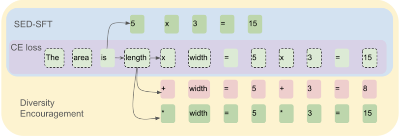
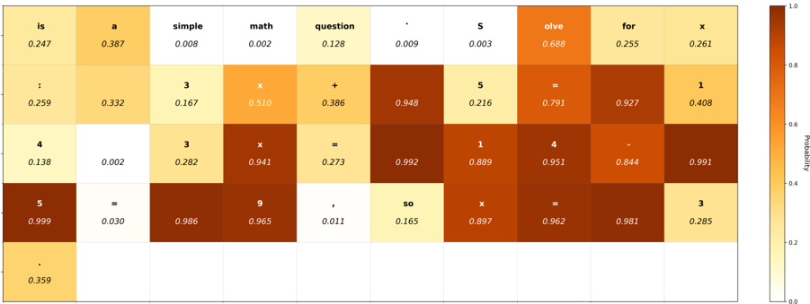

# sed_sft — SED-SFT: Selectively Encouraging Diversity in Supervised Fine-Tuning

> **一句话重点 (TL;DR)**：在 SFT 的交叉熵之上，对"探索空间大"的 token 选择性加一个把 ground-truth 概率往 0.5 推的二次惩罚（被 Top-k 累积概率掩码门控），以保留生成多样性、为后续 RL 留探索空间；RL 后相对 CE 基线平均仅 +1.2~+2.06 点，增量有限且证据面窄。

**元信息**：arXiv 2602.07464v1 ｜ 腾讯 WeChat AI（Yijie Chen*、Yijin Liu*、Fandong Meng） ｜ 2026-02-07 预印本（cs.CL） ｜ 主题 SFT 损失正则 / 为 RL 保探索（与 OPD/蒸馏"SFT 不损害后续可塑性"相关，但本文不涉 teacher distillation） ｜ 代码 https://github.com/pppa2019/SED-SFT （真实可用，含自带 trainer + verl 子目录 + Triton 核） ｜ 框架 自带 torch/transformers/DeepSpeed ZeRO-2 SFT trainer + verl GRPO（RL）

## 关键图示

**① Motivation / 对比图**

*Figure 1: The comparison of Cross-Entropy, pure diversity-encouraging, and SED-SFT. The dashed line token boxes indicate the tokens will be masked in SED-SFT, i.e. , the tokens with low exploration space. SED-SFT achieves a balance between accuracy and diversity by avoiding encouraging the masked to*

**② 方法 / 架构图**

*Figure 2: The heatmap for the probability of the labels on each position. The case is a simple math problem and evaluated on Qwen-0.5B*

## 1. 相关工作与进展
后训练主流范式为 SFT→RL。围绕"SFT 阶段如何不抑制多样性"已有三条线：(1) RL Policy Integration——DFT（Wu 2025）把 RL 策略更新思想引入 SFT，用置信度重加权抑制过大梯度，ASFT（Zhu 2025a）在 DFT 上修偏移但需引入 reference model、成本高；(2) Diversity Modeling——GEM（Li 2024）在目标中显式加 reverse-KL + 熵以鼓励多样生成；(3) Selective Gradient Updating——CTF（Ruan 2025）等需预先确定重要更新位置，依赖先验或高成本算法。另有大量工作（Wang 2025 的 80/20 高熵少数 token、Cui 2025 熵机制）在 RL 阶段做基于熵的探索控制，不直接适用于 SFT。

## 2. 现有工作存在的问题
- RL 阶段的熵控制方法不适用于 SFT（SFT 的 mode collapse 由 token 级 CE 拟合诱发）。
- DFT 在 SFT 阶段精度高但压缩探索空间，后续 RL 难再提升；GEM 鼓励整体多样性却忽视 token 间差异，在高精度任务（数学）上反而掉点。
- 盲目鼓励多样性有害：作者 case study（Appendix A heatmap）发现固定连接词、结构 token、特定词汇这类 token 探索空间本就很小、置信度远高于均值，对其鼓励多样性既无必要又损精度。

## 3. Motivation
多样性鼓励应"选择性"施加于探索空间大的 token，跳过探索空间小的 token，从而在多样性与精度间取得平衡。

## 4. 主要灵感 / 核心直觉
把 SFT 视为策略更新、把 y* 的选择视为二值事件，则 ground-truth 概率决定更新幅度。用累积 Top-k 概率作为量化"token 探索空间"的可观测代理：对 100 道数学题统计发现 k=1 最具区分度但信息不足（看不到替代路径），k 增大趋于均匀失去区分力，故取 k=2 或 3。

## 5. 主要解决思路(一段话讲清核心)
在标准 CE 损失上叠加一个受二值掩码门控的"多样性鼓励项"：掩码用 Top-k 累积概率判定 token 是否落在"探索空间大"区域；鼓励项是一个把 ground-truth token 概率往 0.5（最大熵点）推的二次惩罚。其余 SFT/RL 设置全部保持一致，仅替换 SFT 目标。

## 6. 方法详解(通俗、分步骤)
- **Top-k 掩码 Mt**：P_Top-k(t)=Σ_{j∈Kt} π(y_j|·)（前 k 个最高概率之和），Mt=1[P_Top-k(t)<τ]。阈值 τ 取该批训练样本累积概率集合 P={P_Top-k(t)} 的 (1−r) 分位数（r 为掩码比例）。
- **多样性鼓励函数** L_DE(p)=(p−1/2)²（受 CHORD 启发的二次惩罚，p=π(y*t|·) 为 ground-truth token 概率），p=0.5 处最小、p=1 或 0 处最大，把概率往 0.5 推。
- **总损失** L = Σ_t [ −log π(y*t|·) + λ·Mt·L_DE(π(y*t|·)) ]，论文所有实验 λ=1。
- 超参：k=2 或 3；r>0.5 时稳定优于 CE，最佳 r=0.7（敏感性见 Table 3：r=0.2 时 34.18 反低于 CE 35.65，r=0.7/k=2 最高 37.71）。计算开销相对 CE 几乎可忽略。

## 7. 实验数据集
- SFT：Micomind 数据集采样 20,000 条；lr=2e-5、DeepSpeed stage-2（沿用 GEM 设置）。
- RL：MATH（Level 1）训练切分（DigitalLearningGmbH/MATH-lighteval），每 prompt 用 Qwen2.5-Math-7B-Instruct 采 8 次、过滤全对/全错（类离线 DAPO），从 5,000 得 2,069 条；verl GRPO，batch 256，其余默认。
- 评测（8 个数学基准，遵循 Qwen2.5-Math 框架）：AIME24、AIME25、AMC23、GSM8K、MATH500、GAOKAO-en、OlympiadBench、College-MATH。AIME24/25/AMC23 报 Avg@8（temp 0.7），其余采样 1 次（temp 1.0）。
- 骨干：Qwen2.5-Math-7B-Instruct、Llama-3.2-3B-Instruct。全程 8×H20。

## 8. 实验结果与主要发现
- **RL 后**（八基准均值，Table 1）：Qwen2.5-Math-7B CE 56.00 → SED-SFT 57.20（+1.20）；Llama-3.2-3B CE 35.65 → SED-SFT 37.71（+2.06）。SED-SFT w/o mask 在 Qwen 上 56.60、Llama 上 35.10，介于两者间，验证掩码的增量贡献。
- **SFT 阶段自身**：SED-SFT 几乎不优于甚至略低于 CE（Qwen SFT 均值 SED 42.29 vs CE 43.33；Llama SED 22.04 vs CE 22.25），而 DFT 在 SFT 阶段大幅领先（Qwen 54.24、Llama 25.43）但 RL 后反而垫底（Qwen 55.36、Llama 30.95）。
- **多样性**（Self-BLEU↓，Llama/AIME，Table 2）：SED-SFT 35.57 < GEM 38.53 < CE 43.12 < DFT 51.26，SED-SFT 多样性最高。

## 9. 结果如何支撑其主张
核心主张"SFT 多样性→RL 收益"由两点支撑：SED-SFT 在 SFT 阶段 Self-BLEU 最低（多样性最高）且 SFT 精度不掉，RL 后又取得最高均值；DFT 的反例（SFT 强、RL 弱）反向印证"SFT 阶段压缩探索空间会限制 RL 上限"。掩码消融（w/o mask 介于 CE 与 SED 之间）支撑"选择性"的必要性。逻辑链成立，但绝对增量仅 1~2 点。

## 10. 逻辑自洽性(中性评估)
方法-动机-实验自洽：动机（选择性鼓励）→ Top-k 掩码机制 → 消融验证掩码有效。L_DE 把概率推向 0.5 而非更高熵点，是工程化简化（二值事件下 0.5=最大熵），与"鼓励多样性"一致。主要张力在于卖点完全押在"SFT 多样性传导到 RL 收益"这一间接链路上，而 SFT 阶段自身几乎无收益。

## 11. 残留问题 / 局限
- 增量有限：RL 后绝对提升仅 1~2 点；SFT 阶段 SED-SFT 不如 CE。
- 证据面窄：仅两个骨干、RL 仅 MATH-L1 单数据集、未报多 seed 方差，结论稳健性存疑。
- 新意有限：本质是 GEM/CHORD 思路加 Top-k 累积概率掩码的工程化变体，核心新意在"选择性掩码"这一机制。
- 〔待核/新发现〕**代码与论文的实现差异**：仓库 `utils/sed_triton_loss.py` 中 SEDLoss 默认 `entropy_penalty_scale=0.2`（即 λ=0.2，非论文所述 λ=1），且掩码用固定 `cumsum_threshold=0.95` 而非论文的 (1−r) 分位数自适应阈值 τ；分位数/动态掩码等分支（use_low_topk_cumsum_ratio 等）在类中声明但 forward 默认走固定阈值路径。复现论文配置需自行对齐 λ 与阈值策略。

## 12. 开源代码与框架(链接+框架+代码可得性)
- 仓库 https://github.com/pppa2019/SED-SFT （已 clone，约 15MB；最新 commit 6a89ea3 "Update README"）。
- 核心损失：`utils/sed_triton_loss.py`（SEDLoss，Triton 实现 CE + (p−0.5)² 惩罚 + Top-k 累积掩码），另含 `ce_triton_loss.py`、`gem_triton_loss.py` 作对照；trainer 为 `sft_trainer_v2.py` + `train.py`，脚本在 `train_scripts/`（grpo_math-cumsum.sh、train_cumsum_numina.sh、tokenize_data.sh）。
- RL 阶段：仓库内打包的 `verl/` 子目录上跑 GRPO。
- 代码核心算法可定位、可复现，但默认超参与论文不完全一致（见 §11）。
