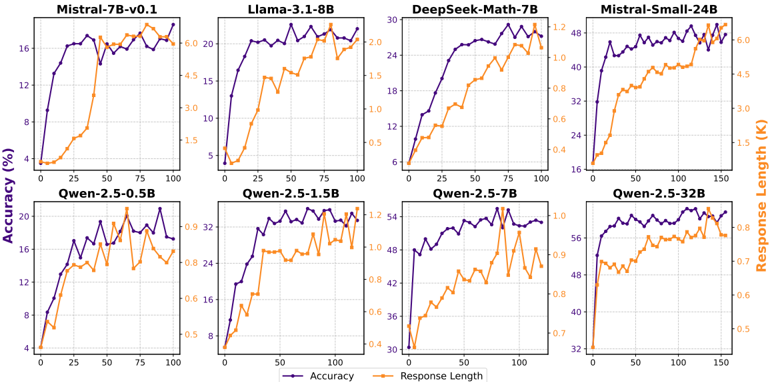
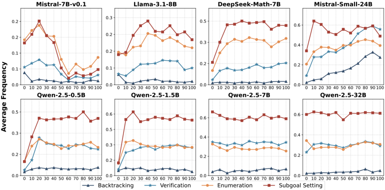

# simplerl_zoo — SimpleRL-Zoo: Investigating and Taming Zero RL for Open Base Models in the Wild

> **一句话重点 (TL;DR)**：在 10 个跨家族/尺寸的 base 模型上做透明的 zero RL（仅正确性二值奖励、不用 format reward），系统拆解成败关键因素，并首次在 Qwen 家族外的小模型上观察到 verification 等认知行为涌现；核心是经验研究与配方/工具开源，而非新算法。

**元信息**：arXiv 2503.18892v3（v1 2025-03-24，v3 2025-08-06 cs.LG） ｜ HKUST + TikTok + 美团（Weihao Zeng*、Yuzhen Huang*、Qian Liu*、Junxian He 等） ｜ 预印本 + Notion 博客 ｜ 主题 T3 RLVR / zero RL 经验研究，相关性 High ｜ 代码 https://github.com/hkust-nlp/simpleRL-reason （已克隆约 66MB，当前版即 v1；HF hkust-nlp/simplerl-zoo collection 10 个模型） ｜ 框架 veRL（仓内自带 verl/，GRPO），旧 v0 用 OpenRLHF+PPO（README 注明）

## 关键图示

**① Motivation / 对比图**

*Figure 1: Accuracy and response length across training iterations for different models, averaged on GSM8K, MATH500, Minerva Math, OlympiadBench, AIME24, and AMC23. Per-benchmark results are in Figure 11 (Appendix D). All training starts from base models.*

**② 方法 / 架构图**

*Figure 5: The change in reasoning behavior over the training iterations across all models. As described in §2.2, we use GPT-4o to extract and track shifts in reasoning behaviors on OlympiadBench. We focus on four reasoning-related behaviors: 'Backtracking', 'Verification', 'Subgoal Setting', and 'En*

## 1. 相关工作与进展
DeepSeek-R1 表明从 base 模型直接做规则奖励的纯 RL（"zero RL training"）可自发涌现长 CoT 与自反思（"aha moment"）。但该成功最初在 671B 的 DeepSeek-V3 上演示，社区复现（Zeng 2025a、Yeo 2025、Xie 2025、Hu 2025、Yu/DAPO 2025）主要集中在 Qwen2.5 系列。

## 2. 现有工作存在的问题
- Qwen2.5 base 因预训练含大量合成数据，本身已具较强指令跟随与 backtracking/verification 行为，**不能代表"in the wild"的多样 base 模型**；
- 现有分析多停留在响应长度、准确率等表层指标，无法判断推理行为是否真正改变，也未澄清推理涌现机制；
- 缺乏对"哪些关键因素决定 zero RL 成败"的系统研究。

## 3. Motivation
在 10 个不同家族/尺寸 base 模型上做透明 zero RL，回答三问：(1) 不同模型推理能力如何演化；(2) 初始缺乏指令跟随/自验证能力的 base 是否仍现 "aha moment"；(3) 跨多样 base 成功 zero RL 的关键因素是什么。

## 4. 主要灵感 / 核心直觉
表层指标（长度、准确率）不足以刻画"推理是否真改变"，需引入认知行为级监控：用 GPT-4o 识别 Backtracking / Verification / Subgoal Setting / Enumeration 四类行为的频率（Reasoning Behavior Ratio），并辅以 Clip Ratio（截断比例）、Average Stopped Length（正常停止响应平均长度），把"长度增长"与"认知行为涌现"解耦观察。

## 5. 主要解决思路(一段话讲清核心)
用最简配方——GRPO + 仅正确性二值奖励（+1/0，**不加 format reward**）+ 全部模型相同超参——在 10 个 base 模型上从零起训，配合两项关键设计（避免刚性格式约束、按模型内在探索能力匹配数据难度），并用认知行为指标透明监控训练动态，归纳成败因素。

## 6. 方法详解(通俗、分步骤)
- **算法**：GRPO；奖励仅判正确性（二值），不用 format reward（避免强格式约束惩罚探索）。
- **数据难度控制**：按难度分 Easy（GSM8K + MATH lv.1）/ Medium（lv.1–4）/ Hard（lv.3–5），各约 8K 题；难度须匹配模型内在探索能力。
- **统一超参**：所有模型同一组超参，弱指令跟随模型用更简单 prompt；均从 base 直接 RL（无 SFT cold start）。
- **监控指标**：Reasoning Behavior Ratio（GPT-4o 标四类认知行为）、Clip Ratio、Average Stopped Length、pass@k。

## 7. 实验数据集
- 训练：仅 GSM8K + MATH 训练集（规则奖励），三档难度各约 8K。
- 模型（10 个）：Mistral-7B-v0.1、Mistral-Small-24B、Llama-3.1-8B、DeepSeek-Math-7B、Qwen2.5-{0.5,1.5,7,14,32}B、Qwen2.5-Math-7B。
- 评测：GSM8K、MATH500、Minerva Math、OlympiadBench、AIME24（Pass@1 与 Avg@32）、AMC23；泛化 IFEVAL、MMLU、GPQA-Diamond。

## 8. 实验结果与主要发现
1. 响应长度增长并不总对应 "aha moment"——多数 Qwen2.5 模型长度涨但认知行为（自反思）频率未升。
2. 首次在 Qwen 家族外的小模型（Llama3-8B、DeepSeek-Math-7B）观察到 verification 等认知行为显著增长。
3. 刚性 format reward（如强制 \boxed{}）会惩罚探索、压低性能上限、诱发 overthinking；许多 base 初期跟不上格式约束，format reward 反而惩罚正确探索（Fig.6 对比）。
4. 训练数据难度须与 base 探索能力匹配，否则 zero RL 失败（如 Mistral-7B 在 Hard 数据上崩溃）。
5. zero RL 提升 pass@k 达 10–30 个绝对点，且 base 与 RL 后模型的 pass@k 差距随 k 增大反而**扩大**（pass@1 与 pass@8 gap 随训练加宽，Fig.3）→ 证明不仅是重排，而是真正增强（与 Shao 2024 观察相反）。
6. 传统短 CoT SFT 作为 cold start 会限制后续 RL 探索，SFT 步数越多对 enumeration/verification 等行为损害越大。
- 总体：仅 8K 样本即对全部模型显著提升（DeepSeek-Math-7B 约三倍增长，长度约 300→1200+ token）；Mistral-Small-24B + SimpleRL-Zoo 平均 27.6→49.6。

## 9. 结果如何支撑其主张
三问均有对应证据：Q1/Q2 由 Reasoning Behavior Ratio 跨模型曲线 + Llama3/DeepSeek-Math 的认知行为涌现支撑；Q3 由 format reward 消融（Fig.6）、难度匹配实验（Mistral 崩溃）、pass@k 扩大（Fig.3）共同支撑"format、难度、是否 SFT cold start"为关键因素。"真正增强而非重排"的主张由 pass@k gap 随 k 扩大这一反直觉证据较强地支撑。

## 10. 逻辑自洽性(中性评估)
作为经验研究自洽性较好：用统一超参 + 多样模型隔离"模型族"变量，用认知行为指标把"长度"与"推理质量"解耦。一个需注意点：Reasoning Behavior Ratio 依赖 GPT-4o 作行为分类器，分类一致性/偏差未深入校验；"aha moment 涌现"部分结论建立在该自动标注之上。

## 11. 残留问题 / 局限
- 无新算法：贡献是配方、模型、分析工具与系统经验，方法学新意有限。
- 仅数学域（GSM8K+MATH）训练，认知行为分类器依赖 GPT-4o，存在标注偏差风险。
- "难度须匹配探索能力"为定性结论，缺乏可操作的难度-能力量化判据。
- 部分结论（如 SFT cold start 损害探索）与具体 SFT 数据/步数强相关，外推到长 CoT SFT 需谨慎。

## 12. 开源代码与框架(链接+框架+代码可得性)
- 仓库 https://github.com/hkust-nlp/simpleRL-reason （已克隆约 66MB，最新 commit cf1c785；当前版即论文 v1 配方）。
- 框架：veRL（仓内自带 `verl/` 目录，pyproject name="verl"），RL 算法 GRPO。核心脚本 `train_grpo_math_tune_ray.sh`（Ray 启动）、`eval_math_nodes.sh`、`install.sh`、`launch_gradio.sh`。README 注明旧版（v0）用 OpenRLHF + PPO。
- 模型：HF hkust-nlp/simplerl-zoo collection（10 个）。代码与配方可得、可复现。
