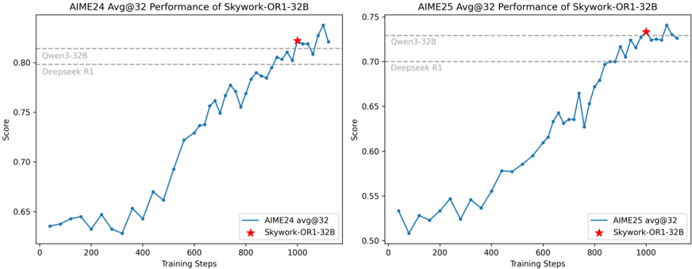
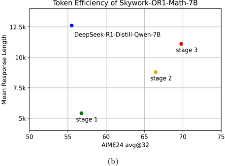

# skywork_or1 — Skywork Open Reasoner 1 Technical Report

> **一句话重点 (TL;DR)**：面向"已蒸馏的长 CoT 模型"的高效可扩展 RL 配方（基于改造版 GRPO，命名 MAGIC），系统消融各组件并深入研究过早熵坍缩，论证"缓解过早熵坍缩对提升测试性能至关重要"；32B/7B 在 AIME+LiveCodeBench 平均分别 +15.0/+13.9，全开源。

**元信息**：arXiv 2505.22312v2（2025-05-29 cs.LG） ｜ Skywork AI（昆仑万维 Kunlun Inc），Jujie He*、Jiacai Liu* 等，通讯 Jujie He ｜ 技术报告 + Notion 博客 ｜ 主题 T3 RLVR / 长 CoT 模型 RL，相关性 High ｜ 代码 https://github.com/SkyworkAI/Skywork-OR1 （已克隆约 11MB；数据 HF Skywork/Skywork-OR1-RL-Data；权重 OR1-{Math-7B,7B,32B} 及 Preview） ｜ 框架 veRL 定制 fork（仓内自带 verl/ + or1_scripts/ + or1_data/，含 Math/Code 验证器）

## 关键图示

**① Motivation / 对比图**

*Figure 1: The performance curve of Skywork-OR1-32B during RL training for AIME 2024 and AIME 2025. The red stars indicate the selected final checkpoints.*

**② 方法 / 架构图**

*Figure 5: Left: Comparison of From-Scratch vs. Multi-Stage training. Top left: Response length during RL training. Bottom left: AIME24 avg@8 performance at temperature 1 (left y-axis) and cumulative training hours (right y-axis). Multi-stage training achieves the same final accuracy with significant*

## 1. 相关工作与进展
DeepSeek-R1 证明 online RL + 简单规则奖励即可大幅提升 base 模型推理。R1-Distill 系列生成的 CoT 在 AIME24 上平均超 10K token，远长于 Qwen2.5/Llama3.1。已有复现（Logic-RL、ORZ、DAPO、VAPO）多聚焦对 base 模型 RL；DeepScaleR、Light-R1、DeepCoder 等开始探索对长 CoT 模型 RL，但未系统拆解组件贡献。

## 2. 现有工作存在的问题
- 如何高效、可扩展地用 RL 提升**已做过 SFT 的长 CoT 模型**仍不清楚；
- DeepScaleR、Light-R1、DeepCoder 等虽有初步进展，但未系统拆解各算法组件在 RL 训练中的独立贡献；
- 训练中普遍出现 premature entropy collapse（过早熵坍缩、过度 exploitation），其成因与缓解缺乏系统研究。

## 3. Motivation
提出针对长 CoT 模型的高效可扩展 RL 配方，系统消融各组件；深入研究熵坍缩现象，证明缓解过早熵坍缩对提升测试性能至关重要；全开源代码、数据、权重。

## 4. 主要灵感 / 核心直觉
把"维持探索能力"操作化为"用 target-entropy 给策略熵托一个动态下界"：当熵被自适应机制下界托住时，模型保持探索能力与高学习可塑性，测试性能稳步提升；过早熵坍缩则普遍对应更差性能（§4.2）。

## 5. 主要解决思路(一段话讲清核心)
在改造版 GRPO（命名 **MAGIC = Multi-stage Adaptive entropy scheduling for GRPO In Convergence**）上，从 数据收集 / 训练策略 / 损失函数 三方面组合多项设计，并通过逐组件消融验证；其中以"自适应熵控制 + 多阶段长度调度 + on-policy + 高温采样 + 去 KL"为核心。

## 6. 方法详解(通俗、分步骤)
- **数据收集**：严格预处理 + 更准验证器；离线+在线过滤（去掉 base 正确率为 0/1 的题、每阶段开始丢弃上阶段已全对的题）；Rejection Sampling（batch 仅保留含非零 advantage 的组）；model-aware 难度估计。
- **训练策略**：(1) Multi-Stage Training——逐阶段增大 context 长度 T（借鉴 DeepScaleR），先短后长省算力又保 scaling；(2) **不采用 advantage mask**——实验（§3.2.3）证明对截断响应赋负 advantage 反而提升 token 效率且不损后期 scaling，故最终不用任何 advantage mask；(3) High-Temperature Sampling（τ=1）保探索；(4) On-Policy Training（7B/32B 严格 on-policy，显著减缓熵坍缩；Math-7B 用两步梯度更新，非严格 on-policy）。
- **损失函数**：去掉 1/|y_ij| 长度归一项 → token 级 policy loss（全 batch token 平均，缓解长度偏置）；(1) Adaptive Entropy Control——引入 target-entropy 超参，按当前熵与目标熵之差动态调 entropy loss 系数，使熵被 target 下界托住；(2) No KL Loss（KL 项在多阶段后期反而妨碍提升）。

## 7. 实验数据集
- 训练：自建数据 mixture（严格难度过滤 + 质量控制，含从 NuminaMath-1.5 过滤的 hard 题），对照 DeepScaleR mixture（AIME/AMC/Omni-MATH/STILL）；含数学与代码题，配 Math Verifiers + Code Sandboxes。
- 评测：AIME24、AIME25、LiveCodeBench（2024-08~2025-02）；主指标用 Avg@K 而非 Pass@1。
- 基座：DeepSeek-R1-Distill 系列（7B/32B 等已蒸馏长 CoT 模型）。

## 8. 实验结果与主要发现
- Skywork-OR1-32B：AIME24/AIME25/LiveCodeBench 平均 57.8%→72.8%（+15.0），AIME 上超 DeepSeek-R1 与 Qwen3-32B、LiveCodeBench 持平；7B 43.6%→57.5%（+13.9）。
- 多阶段效率：Stage I T=8K → Stage II T=16K（step 540 切换）→ Stage III；同样最终精度但省约 100 训练小时/1000 步，token 效率显著更高（平均长度约 12.5K→5.4K）。
- 熵动态关键发现：熵坍缩越快测试性能越差；增大 batch/group 对熵动态影响小，而提高采样温度影响显著；off-policy 更新（增大 mini-batch / 数据复用 N_SGD）加速熵坍缩并劣化性能；通过自适应 entropy 系数或 clip-higher 可减缓熵坍缩。

## 9. 结果如何支撑其主张
"配方高效可扩展"由 32B/7B 的 +15/+13.9 与多阶段省算力（100 小时/1000 步、12.5K→5.4K token）支撑；"组件各有贡献"由逐组件消融（§3.2.1–3.2.6）支撑；"缓解过早熵坍缩至关重要"由 §4 一系列对照（熵坍缩速度 vs 性能、N_SGD/off-policy 影响、自适应熵/clip-higher 缓解效果）支撑，证据较充分。

## 10. 逻辑自洽性(中性评估)
作为技术报告自洽性好：MAGIC 各组件均有独立消融，熵坍缩论证有多角度对照。需注意：诸多结论（如"高温影响大、batch/group 影响小"）建立在自建数据 mixture + DeepSeek-R1-Distill 基座这一特定设置上；advantage mask 的"反而提升 token 效率"结论与部分截断惩罚直觉相反，依赖其多阶段长度调度场景，外推到非多阶段设置需谨慎。

## 11. 残留问题 / 局限
- 强工程报告属性：贡献是配方组合 + 系统消融 + 开源，单个组件多借鉴已有工作（DeepScaleR 多阶段、clip-higher 等）。
- target-entropy 等关键超参的设定缺乏跨基座/任务的可迁移性论证。
- 评测面集中在 AIME + LiveCodeBench，泛化基准较窄。
- Math-7B 采用非严格 on-policy（两步梯度更新），与 7B/32B 的严格 on-policy 不一致，削弱了"on-policy 减缓熵坍缩"结论在 Math-7B 上的纯净性。

## 12. 开源代码与框架(链接+框架+代码可得性)
- 仓库 https://github.com/SkyworkAI/Skywork-OR1 （已克隆约 11MB，最新 commit 64e96af）。
- 框架：veRL 定制 fork（仓内自带 `verl/` + `or1_scripts/` + `or1_data/`，含 Math/Code 验证器与 code sandbox）；RL 算法为改造版 GRPO（MAGIC）。
- 数据：HF Skywork/Skywork-OR1-RL-Data；权重：Skywork-OR1-{Math-7B,7B,32B}（及 Preview 版）。代码、数据、权重全开源，可复现性高。
