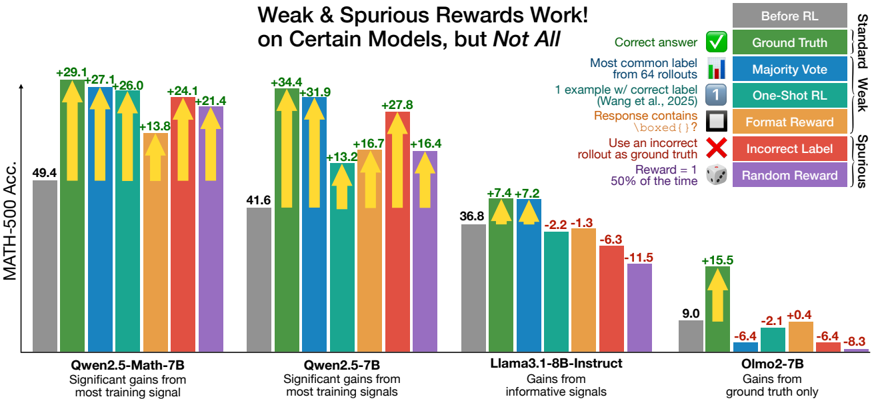
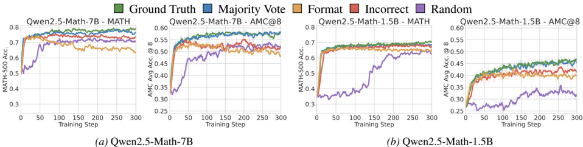

# spurious_rewards — Spurious Rewards: Rethinking Training Signals in RLVR

> **一句话重点 (TL;DR)**：在 Qwen2.5-Math 上，即使用随机/格式/错误标签等"虚假奖励"做 RLVR 也能大幅涨分（随机奖励 MATH-500 +21.4%，接近真值的 +29.1%），原因是 GRPO 的裁剪偏置放大了 base model 已有的高先验行为（如 code reasoning），而非注入新能力；该效应在 Llama3/OLMo2 等模型族上几乎消失。

**元信息**：arXiv 2506.10947（v2, 2026-02-25）｜ University of Washington / AI2 / UC Berkeley（Rulin Shao\*、Shuyue Stella Li\*、Rui Xin\*、Scott Geng\* 等，… Nathan Lambert、Sewon Min、Pang Wei Koh、Luke Zettlemoyer）｜ Preprint（RLVR 训练信号机理分析）｜ 主题 T3（RLVR / Zero-RL 机理）/ 相关性 High（直击"RL 是否注入新能力 vs. 仅放大先验"，与本项目教师脚手架蒸馏的核心追问对齐）｜ 代码 https://github.com/ruixin31/Rethink_RLVR （本地已克隆 ~259MB，Tier A）｜ 框架 **OpenRLHF**（经 PRIME-RL 的 TTRL 改编；论文正文亦自述"沿用流行 RL 框架 OpenRLHF 的默认评测设置"）

## 关键图示

**① Motivation / 对比图**

*Figure 1. MATH-500 accuracy after 300 steps of RLVR on various training signals. We show that even 'spurious rewards' (e.g., rewarding incorrect labels or with completely random rewards) can yield strong MATH-500 gains on Qwen models. Notably, these reward signals do not work for other models like L*

**② 方法 / 架构图**

*Figure 2. Model performance on MATH and AMC with varied training rewards smoothed over window size of 10 (dotted lines are unsmoothed values). We report pass@1 for MATH and average@8 for AMC. Both Qwen2.5-Math-7B and Qwen2.5-Math-1.5B significantly improve after RLVR on a range of reward signals fro*

## 1. 相关工作与进展
RLVR（可验证奖励强化学习）已成为提升 LLM 数学推理的主流后训练范式，开源社区高度依赖 Qwen2.5-Math 系列作为事实标准 base model，大量"zero-RL"结论均基于该单一模型族。相关探索包括：TTRL（用多数投票估计伪标签做无监督 RL）、各类弱监督/自监督奖励设计。本文把这些"奖励信号是否必须准确"的隐含假设系统化地推到极端来检验。

## 2. 现有工作存在的问题
多数 RLVR 方法仅在 Qwen 上验证、缺乏跨模型族确认；社区默认把"Qwen 上的增益"等同于"真实推理能力提升"，忽视预训练先验对 RL 动力学的塑造作用，从而可能高估了 RL 算法本身的贡献。

## 3. Motivation
用一组从弱到虚假递进的奖励作诊断探针，检验 RLVR 究竟需要多少有效监督信号，并解释为何 Qwen 上即使无信息奖励也能涨分。

## 4. 主要灵感 / 核心直觉
若涨分主要来自"放大 base model 已有高先验行为"，那么奖励是否携带正确信号就不再是必要条件——只要更新方向系统性偏向高先验 token 即可。GRPO 的 clip 机制恰好提供了这种与奖励无关的偏置来源。

## 5. 主要解决思路(一段话讲清核心)
设计奖励梯度链（Ground Truth → Majority Vote → Format → Random → Incorrect Label），只替换奖励函数、固定其余超参，在多模型族上跑 GRPO，观测增益差异；再用裁剪偏置的理论推导 + code reasoning 行为分析解释"为何无信息奖励在 Qwen 上仍涨分"，并用 prompt-based / RL-based 干预验证机理。

## 6. 方法详解(通俗、分步骤)

- **奖励梯度链**：Ground Truth → Majority Vote（64 rollout 多数投票伪标签）→ Format（含非空 `\boxed{}` 即给 1）→ Random（概率 γ 随机给 1，主实验 γ=0.5）→ Incorrect Label（只奖励多数投票得到的错误答案）。
- **主结果（Qwen2.5-Math-7B, MATH-500 绝对涨幅）**：GT +29.1、Majority +27.1、Format +13.8/+15.5、Incorrect Label +24.1、Random +21.4，仅个别（如某弱奖励变体）为 −6.4。即随机奖励涨幅已接近真值。
- **跨族对比**：上述效应在 Llama3.1/3.2、OLMo2、Qwen2.5（非 Math）上几乎无效甚至掉点——说明依赖 base 先验。
- **机理（GRPO 裁剪偏置 clipping bias）**：clip 项使更新系统性放大 base model 中高先验概率的 token/行为，即使奖励无信息也会强化"高先验行为"；附录给出完整推导（随机奖励诱导的梯度正比于策略相对行为策略的概率偏离）。
- **关键案例行为 code reasoning**：Qwen2.5-Math-7B 含 Python 代码（无执行器，纯文本推理）的回答正确率 60.9% vs 无代码 28.0%；虚假奖励下 code 频率 15 步内升至 ~90%、随机奖励最高 95.6%，紧跟准确率上升。模型按 No-Code / Bad-Code / 有效 code 分类，解释跨族差异。
- **验证**：用 prompt-based 与 RL-based 干预显式提升 code reasoning 与词汇重复，均显著抬升 Qwen 表现，反向印证机理。

## 7. 实验数据集

- 训练：DeepScaleR；及其多数投票伪标注 / 错误标注派生集（如 `DeepScaleR_mv_labeled_llama3.2_3b_instruct_incorrect`）。
- 评测：MATH-500（pass@1）、AMC（avg@8）、AIME 2024/2025。
- 模型：Qwen2.5-Math-7B/1.5B、Qwen2.5-7B/1.5B、Llama3.1-8B(-Instruct)、Llama3.2-3B(-Instruct)、OLMo2-7B 及 OLMo2-7B-SFT。

## 8. 实验结果与主要发现

- 随机奖励即可使 Qwen2.5-Math-7B MATH-500 +21.4%（vs GT +29.1%）；错误标签奖励 +24.1%。
- 同样的虚假奖励在 Llama3/OLMo2 等族上失效，强力支持"先验依赖"假说。
- code reasoning 频率与准确率高度耦合（升至 90%+，随机奖励 95.6%），是 Qwen 涨分的主要可观测中介行为。

## 9. 结果如何支撑其主张
跨族对照（Qwen 涨 / 他族不涨）+ 机理推导（裁剪偏置）+ 干预验证（显式抬升 code reasoning 即涨分）三条证据互相印证，较有说服力地支撑"RLVR 在开源算力规模下主要是激发/放大已有潜在能力，而非教会新能力"。

## 10. 逻辑自洽性(中性评估)
论证链条自洽：诊断探针—跨族对照—理论解释—干预复现闭环。裁剪偏置推导与 code reasoning 行为分析互为佐证。需注意：结论的适用范围被作者自限于"当前开源后训练算力规模"，并非否定 RLVR 在更大规模下的能力增益。

## 11. 残留问题 / 局限

- 结论强绑定 Qwen2.5-Math 这一特殊（预训练即含大量含代码数学解）base model，外推到通用模型/更大算力需谨慎。
- "虚假奖励涨分"仅是分析工具，不构成可用训练方案（作者明确不推荐）。
- 裁剪偏置推导基于若干简化假设；code reasoning 作为中介行为是相关性证据，未必穷尽全部机理。
- README 文末示例把 R1-style 奖励后缀写作 `_r1_only`，与实际代码/脚本一致使用的 `_r1_style` 不符（README 笔误，不影响复现，以代码为准）。

## 12. 开源代码与框架(链接+框架+代码可得性)

- 规范仓库：https://github.com/ruixin31/Rethink_RLVR （本地已克隆 ~259MB，Tier A，代码完整可跑）。模型集合：HuggingFace `stellalisy/spurious-rewards`；复现页见 Notion / W&B。
- **框架：OpenRLHF**（README 自述代码库改编自 PRIME-RL 的 TTRL，TTRL 本身为 OpenRLHF 衍生；`code/ttrl/` 多处引用 OpenRLHF issue，训练脚本用 OpenRLHF 风格参数 `micro_train_batch_size`/`n_samples_per_prompt`/`--advantage_estimator group_norm`/`--normalize_reward`）。算法主体 **GRPO**（advantage 用 `group_norm`，见 `ttrl/trainer/experience_maker.py`）。环境：python 3.10 + flash_attn 2.7.0.post2，`pip install -e .`。〔原稿曾误记 veRL，现据 README、`ttrl/` 代码与论文正文确认为 OpenRLHF。〕
- 关键超参（`scripts/rlvr_deepscaler_grpo_qwen_*.sh`）：训练 300 步、binary 0-1 奖励、`train_batch_size=128`、`n_samples_per_prompt=16`、`micro_train_batch_size=4`、`gamma=1.0`；仅改 `TASK`/`REWARD`。奖励函数实现见 `ttrl/verifier/qwen/qwen_eval.py` 与 `ttrl/verifier/auto_verify.py`（`random_reward_fn(rate=0.5)`、`inverse_qwen_reward_fn`、`box_only_format_reward_fn` 等）。无 chat template 模型加 `_r1_style` 后缀（脚本 `--verify_task "${REWARD}_r1_style"` 已确认）。
