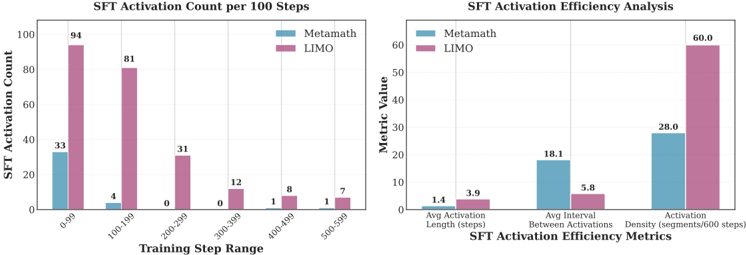
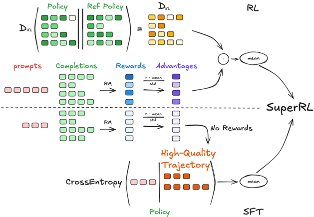

# superrl — SuperRL: Reinforcement Learning with Supervision to Boost Language Model Reasoning

> **一句话重点 (TL;DR)**：在 RLVR 流程内做实例级自适应回退——某 prompt 的所有 rollout 都拿到零奖励（无 PG 梯度信号）时，就在该 prompt 上回退到高质量离线示范（tagged_answer）做 SFT，否则走标准 GRPO/PPO；二选一、不做损失融合，专治稀疏奖励下 rollout 全失败的"无梯度"困境。

**元信息**：arXiv 2506.01096（v2, 2025-08-08）｜ 北京大学 / UIUC / 微软（Yihao Liu, Shuocheng Li, Lang Cao, Yuhang Xie 共同一作，通讯 Mengyu Zhou）｜ Preprint, under review, 2025 ｜ 主题 T3（统一 SFT-RL，GFT 类）/ 相关性 中高（按 reward 信号在 RL 与 SFT 间切换，与本项目"信号不足时回退教师监督"思路一致）｜ 代码 https://github.com/microsoft/SuperRL （仅核心组件，需集成进官方 verl v0.5.0+）｜ 框架 veRL（volcengine，v0.5.0）+ FSDP + 梯度检查点

## 关键图示

**① Motivation / 对比图**

*Figure 2: Analysis of SFT Activation Patterns and Efficiency. Left: The histogram shows the count of supervised fine-tuning (SFT) activations per 100 training steps for two datasets: Metamath and LIMO . Most SFT activations in both cases occur in the early phase of training (0-100 steps), with LIMO*

**② 方法 / 架构图**

*Figure 1: Overview of SuperRL . SuperRL is a unified training framework that adaptively combines RL and SFT based on reward signal. During training, for each input, the model samples multiple rollouts and computes their rewards. If at least one trajectory receives a nonzero reward, standard RL updat*

## 1. 相关工作与进展
LLM 推理任务常有大量高质量离线数据（专家标注 / 蒸馏轨迹）。在线 RL（PPO/GRPO）是 on-policy，只能从当前策略采样轨迹学习，难利用分布外离线数据；传统两阶段 SFT→RL（RLHF 范式）则在 RL 阶段易灾难性遗忘 SFT 知识。SuperRL 属"在 RL 流程内细粒度统一 SFT/RL"的方向。

## 2. 现有工作存在的问题

- 纯 SFT 只记忆正例，缺乏从错误/负例学习的机制。
- 纯在线 RL 在稀疏奖励下因 rollout 全失败而拿不到梯度信号。
- 两阶段 SFT→RL 在 RL 阶段灾难性遗忘 SFT 知识，样本/算力效率低；过拟合离线轨迹与狭窄 RL 目标又损泛化。

## 3. Motivation
将 SFT 与 RL 在更紧粒度（实例级 interleave/unify）统一，让模型在在线信号不足时回退到高质量离线监督，从而在稠密与稀疏奖励两种 regime 下都稳定有效学习。

## 4. 主要灵感 / 核心直觉
稀疏奖励下"全 rollout 失败"恰是 SFT 最该介入的时刻——此时 RL 无任何梯度，而离线示范能提供确定的学习信号。把"是否有有效 PG 信号"作为实例级的自动开关，无需手工阶段切换。

## 5. 主要解决思路(一段话讲清核心)
对每个 prompt 采样多条 rollout 算 reward：只要存在非零 reward（有 PG 信号）就走标准 policy gradient；若该 prompt 所有 rollout reward 全为 0（无梯度）则回退到在该 prompt 上对离线示范做交叉熵 SFT。二选一，不融合。

## 6. 方法详解(通俗、分步骤)
**核心方法（主推，`SuperRLActor`）：实例级自适应回退（adaptive switching / fallback）。**

- `SuperRLActor.update_policy`：用 `advantages*response_mask` 与 `token_level_rewards*response_mask` 的**绝对均值是否 > eps** 双重判定信号有效性（`pg_signal_eps=1e-8`、`reward_eps=1e-8`）；
- 有有效信号 → `_ppo_update`（复用父类 GRPO/PPO）；两者皆 ~0（无梯度）→ `_sft_update`：对 `extra_info["tagged_answer"]` 做 `F.cross_entropy(..., reduction="mean")`。

论文给出两个变体（代码也提供）：

- **Hybrid-Adv-Gated**（`HybridAdvGatedActor`）：有效 PG 信号→PPO，否则→SFT，同样不融合（比 SuperRLActor 少一层 reward 检查，仅判 advantage）。
- **Hybrid-Log-Sigma**（`HybridLogSigmaActor`）：用学习到的不确定性权重软融合：`L = exp(−2·σ_pg)·L_ppo + exp(−2·σ_sft)·L_sft + (σ_pg + σ_sft)`，`log_sigma_pg/sft` 为可学习参数加入优化器（init 0 / 1）；并带 σ 随步衰减（`sigma_decay_rate=0.99`、`min_log_sigma=−2.0`）。论文指出变体虽有改进但需额外调参/开销，主推简洁的实例级回退。

## 7. 实验数据集
覆盖稠密奖励任务（GSM8K、MetaMathQA）与稀疏奖励任务（OpenR1-Math-220k、PRM12K/MixChain-Z-PRM12K），另含 LIMO、AIME24/AIME25、HiTab（层级表格 QA）。Backbone 跨三族：Qwen2.5（0.5B/1.5B/3B/7B）、LLaMA 3.x（3.2 1B/3B、3.1 8B）、DeepSeek-R1-Distilled。SFT/SFT+RL 基线用相同数据/学习率/上下文长度；actor 与 critic 默认从同一预训练 checkpoint 初始化。

## 8. 实验结果与主要发现
SuperRL 在 GSM8K/Metamath/PRM12K/LIMO/OpenR1/AIME 上全面优于 RL、SFT、SFT+RL 基线（如 GSM8K 78.86 vs RL 72.29；已核实表中数字）。在稀疏奖励任务上的相对优势尤为关键，印证"无梯度时回退 SFT"的设计。

## 9. 结果如何支撑其主张
跨稠密/稀疏两类任务、三模型族的一致优于基线，支撑"实例级回退在两种 regime 下都稳健"的核心主张。但增益幅度（如 GSM8K +6.6pp）属稳健改进而非数量级。

## 10. 逻辑自洽性(中性评估)
方法逻辑清晰自洽：判信号→二选一更新。代码与论文描述一致（双 eps 判定、cross_entropy 回退、Log-Sigma 软融合公式）。需注意：阈值 eps=1e-8 极小，意味着"几乎任何非零 advantage"都判为有效信号、回退仅在严格全零时触发——回退频率高度依赖奖励稀疏度，论文未给出回退触发率的统计。

## 11. 残留问题 / 局限

- 仓库仅核心组件（actor/dataset/reward/预处理），**非完整训练框架**，需拷入并集成进官方 verl v0.5.0+ 对应目录（改 `fsdp_workers.py`、`main_ppo.py`、`ray_trainer.py`）才能运行——复现门槛较高。
- 回退依赖每个 prompt 都备有高质量 `tagged_answer`（离线示范），真实稀疏场景未必都有。
- 主方法是硬切换，对"部分有信号"的中间情形无细粒度调节；软融合变体则需额外调参。
- 回退触发率、SFT 与 RL 更新步占比等关键运行时统计未充分报告。

## 12. 开源代码与框架(链接+框架+代码可得性)

- https://github.com/microsoft/SuperRL 。仓库提供 `actor/`（`SuperRLActor.py`、`HybridAdvGatedActor.py`、`HybridLogSigmaActor.py`）、`dataset/`（`HybridDataset`）、`reward/`（`superrl.py` 统一数学奖励）、`data_preprocess/`；需集成进官方 verl。
- 框架：veRL（v0.5.0）；三 actor 均继承 `verl.workers.actor.dp_actor.DataParallelPPOActor`，通过 `actor_type`（`superrl`/`hybrid_adv_gated`/`hybrid_log_sigma`/`default`）在 `fsdp_workers.py` 选用；adv_estimator 用 grpo。FSDP + 梯度检查点。
- 流程：`HybridDataset` 加载 prompt + `tagged_answer`（预处理脚本将 GSM8K/MetaMath/OpenR1/PRM12K/LIMO/HiTab 转 parquet）→ verl GRPO 流程采样 rollout → `reward/superrl.py` 打分 → 自定义 actor 的 `update_policy` 按信号有效性实例级切换（主方法）或软融合（Log-Sigma 变体）。集成方式见 README。
