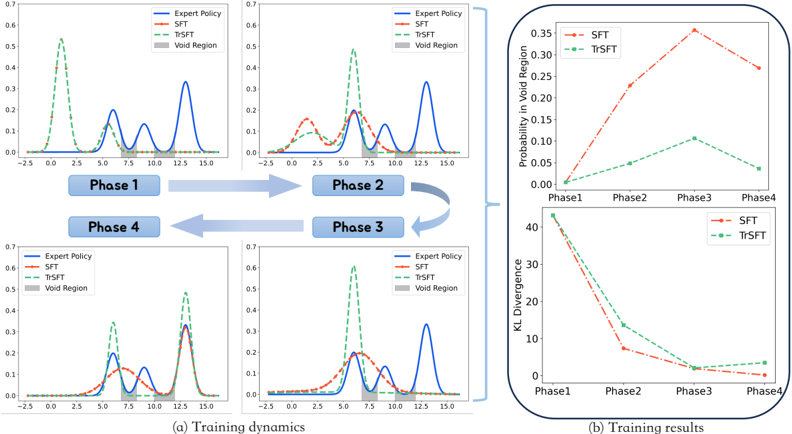
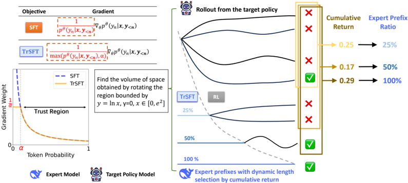

# trapo — TRAPO: Trust-Region Adaptive Policy Optimization

> **一句话重点 (TL;DR)**：在每个训练实例内细粒度交织 SFT 与 RL——只对专家轨迹**前缀**做 SFT、其后由目标策略自行 rollout 补全做 RL；用 Trust-Region SFT（把 SFT 权重 1/p_θ 改为 1/max(p_θ,α)）把 forward-KL 的 mode-covering 转成 reverse-KL 式 mode-seeking、稳住 RL 起点，再用 micro-group 采样按累计回报自适应分配前缀长度。

**元信息**：arXiv 2512.17636v1（2025-12-19，cs.LG）｜ 清华大学 CoAI 组 + Ant Group（Mingyu Su、Jian Guan、Yuxian Gu、Minlie Huang、Hongning Wang；通讯黄民烈、王宏宁）｜ README/OpenReview 标注 ICLR 2026 ｜ 主题 SFT+RL 实例级统一后训练，与 TSRD 高度相关（专家前缀脚手架 + 自探索补全 = path-selection/recovery 的一种实现；与 mtp_opd 的 MTP foresight 无直接关系，但前缀-脚手架是可借鉴的对照基线）｜ 代码 https://github.com/Su-my/TRAPO （已 clone ~6MB，基于 LUFFY/verl）｜ 框架 verl 的 GRPO（去 KL penalty）+ 自定义 TrSFT

## 关键图示

**① Motivation / 对比图**

*Figure 3: An illustrative experiment showing the training dynamics during SFT. Panel (a) shows snapshots of learnt target policy at four consecutive training phases, corresponding to training steps of 0, 50, 100, and 1000, respectively. Panel (b) presents the KL divergence curve along with the chang*

**② 方法 / 架构图**

*Figure 1: An overview of our TRAPO framework, which synergistically combines two key components: Trust-Region SFT (TrSFT) and Adaptive Expert Guidance. Left: By clipping the gradient weight with a trust-region parameter α , TrSFT prevents exploding gradients on low-probability tokens, ensuring a sta*

## 1. 相关工作与进展

- **RL for LLM reasoning**：o1/R1/Kimi-1.5 等里程碑；后续从经验分析（Yue 2025a：RL 精炼既有解轨迹而非扩展能力）、数据中心（R3 反向课程、ADARFT/Logic-R1 动态难度）、优化方法（PPO/GRPO/DAPO/Dr.GRPO/VAPO）三向推进。
- **SFT 与 RL 结合**：直接加权两 loss（SRFT 按 token 熵动态调权；AMFT 用 meta-gradient 学权重；HPT 按 rollout 表现二值选 SFT/RL）；或在 RL 流水线内插 SFT（ReLIFT 收集 RL 中差样本入 buffer 后做 SFT；LUFFY 把 1 条专家轨迹当 offline 数据混进 7 条 online、用重要性比校准分布漂移）。**最相近 Prefix-RFT**（Huang 2025）采样前缀作引导、用熵选专家 token 做 SFT。TRAPO 自称首个**理论**研究 SFT+RL 目标结合挑战并给解。

## 2. 现有工作存在的问题
两阶段 SFT→RL 范式根本不一致：(1) SFT 把模型锁进刻板模仿、抑制 RL 所需探索；(2) SFT 易致灾难性遗忘，使 RL 难用预训练知识。更低 SFT loss 并不意味更好 RL 起点，过度 SFT 反把模型推出适合 RL 的区域且无即时信号。论文实证：**朴素地把 SFT loss 与 RL loss 直接相加导致灾难性崩溃**（较纯 RL 低 18 分以上，Table 2 验证）。根因：标准 SFT(最小 forward KL) 的 mode-covering 特性给专家无支撑的"空洞区"分配概率，引发重复/退化解码——在 SFT/RL 逐实例交织时立即毒化探索。

## 3. Motivation
把 SFT 与 RL 在**每个训练实例内细粒度交织**：只对专家轨迹前缀做 SFT，其后目标策略自行 rollout 补全做 RL，既吸收专家蒸馏收益、又不损探索与预训练知识。需解决两挑战：(1) 如何有效内化前缀知识（学习目标）；(2) 如何为每 prompt 选最优前缀长度（引导选择）。

## 4. 主要灵感 / 核心直觉
GMM pilot 实验揭示 SFT 的 distribution-blending：标准 SFT 梯度里 \(1 / p_\theta\)(yn|·) 在专家 token 落在远离当前策略模式时会爆炸，先把策略推进"空洞区"再慢慢修正。在交织设定下任何分到空洞区的概率质量都会立即产出退化 rollout。直觉：建立一个"信赖域"，区域内信任标准 SFT 梯度、激进模仿；区域外用常数权重 1/α 抑制梯度，只追专家主模式——即把 mode-covering 转成 mode-seeking。另一直觉（Fig.2 pilot）：越长的专家前缀稳步提升准确率并激发 backtracking / backward chaining 等高级推理行为，故"按需给最小前缀"是合理脚手架。

## 5. 主要解决思路(一段话讲清核心)
对每 prompt：先无引导自探索 rollout→若回报不足则按递增阈值注入越来越长的专家前缀→目标策略补全→对补全部分用标准 GRPO、对专家前缀部分用 TrSFT loss，全轨迹联合优化。TrSFT 把 SFT 梯度权重从 1/p_θ 改为 1/max(p_θ,α)（α 信赖域边界）；micro-group 采样按前面微组的平均回报与阈值决定本微组的前缀长度比。

## 6. 方法详解(通俗、分步骤)

- **Trust-Region SFT (TrSFT)**：标准 SFT 梯度 ∇L_SFT 含权重 1/p_θ(yn|·)；TrSFT \(1 / \max(p_\theta(y_n \mid \cdot),\, \alpha)\)（α∈[0,1]）。p_θ≥α 时用标准 SFT 激进模仿；p_θ<α 时用常数 1/α 抑制梯度。**Prop.1**（已核对论文 §A.2 KKT 推导）：其最优解 \(p^{*}_T(c) = p_E(c) / \lambda\)（若 p_E(c)>αλ）否则 0，其中 \(\lambda = \sum_{c \in S(\lambda)} p_E(c)\)——即**剪掉专家低概率区、对主模式重标定，把目标从 forward-KL 的 mode-covering 转向 reverse-KL 的 mode-seeking**，给 RL 稳定起点。
- **Micro-group Sampling（自适应前缀选择）**：每 prompt 顺序建 N 个微组，各组由 (前缀长度比 L_i、回报阈值 t_i、采样预算 n_i) 决定。先做无引导自探索（L_1=0、t_1=−1 保证恒触发）；若前面微组平均回报 < t_i，则给长度比 L_i 的专家前缀再采 n_i 个补全；\(0 = L_1 < L_2 < \ldots < L_N = 1\)（L_N=1 可给完整专家路径）。"仅在需要时给最小引导"。
- **联合更新**：补全用标准 GRPO 目标、专家前缀用 TrSFT loss，全轨迹统一优化（完整流程 Appendix B Algorithm 1）。

## 7. 实验数据集

- 训练：OpenR1-Math-46k-8192（DeepSeek-R1 生成、已验证的数学推理轨迹），并额外为每题配一条来自 OpenR1-Math-200k 的轨迹增多样性。
- 基座：Qwen2.5-Math-7B（主）；另在 Qwen2.5-7B-Instruct 验证通用性。pilot 用 Qwen2.5-3B-Instruct + DeepSeek-R1 前缀（MATH-500）。
- 评测：**5 个数学** benchmark = AIME2024、AMC、MATH-500、Minerva、OlympiadBench（AIME/AMC 样本少故报 avg@32，其余 pass@1）；**2 个通用** = ARC-c、MMLU-Pro（pass@1）。

## 8. 实验结果与主要发现

- 主结果（Table 1，Qwen2.5-Math-7B 基座）：5 数学 benchmark 均值 **TRAPO 56.6**，较 standalone SFT(50.3) **+6.3**、纯 GRPO(50.4) **+6.2**、强基线 SFT-then-RL(54.3) **+2.3**，也超 ReLIFT(53.4)/LUFFY(55.5)。通用域均值 68.3 居首。注意单 benchmark 上 TRAPO 不一定最高（如 AIME2024 TRAPO 28.3 < Oat-Zero 33.4、SFT-then-RL 33.5），优势在综合均值。
- 消融（Table 2）：micro-group 单独已超 GRPO（52.7 vs 50.4）；+ 标准 SFT loss 崩溃（32.3）；+ LUFFY loss 仅小增（53.6）；**+ TrSFT 达 56.6**——证 TrSFT 是稳定结合的关键。
- 训练动态（Fig.4）：TRAPO 全程更高 reward、早期快速增长生成长度（快速内化专家长推理）、长期稳在较高 policy entropy（保留探索）。
- Test-time scaling（Fig.6 pass@k on AIME2024）：纯 GRPO 在大 k 下被 base 反超（RL 只筛选既有解空间），TRAPO 与 SFT 类一样随 k 强 scaling（扩展了底层解空间）。
- 通用模型（Fig.5，Qwen2.5-7B-Instruct）：TRAPO 5 数学均值 45.20 > GRPO 40.60 > Base 39.72 > SFT 32.98。

## 9. 结果如何支撑其主张

- "朴素相加会崩"：Table 2 中 micro-group+标准 SFT loss 掉到 32.3（较纯 RL 低 18+ 分）直接验证。
- "TrSFT 是关键"：同一 micro-group 骨架下，换 TrSFT(56.6) vs LUFFY loss(53.6) vs 标准 SFT(32.3) 的对比，把增益归因到 TrSFT。
- "扩展解空间而非筛选"：pass@k（Fig.6）TRAPO 不被 base 反超，支撑 test-time scaling 主张。
- "保留探索/不灾难遗忘"：Fig.4 较高稳态 entropy + 通用域不退化（68.3）佐证。

## 10. 逻辑自洽性(中性评估)
理论-方法链条自洽：诊断（mode-covering 致空洞区）→TrSFT（信赖域裁剪→Prop.1 等价 mode-seeking）→micro-group（按需最小引导）→联合优化。Prop.1 的 KKT 推导完整、forward→reverse KL 的转变有理论支撑。一处需留意的张力：正文 GRPO"without KL penalty"，但仓库默认 `use_kl_loss: True, kl_loss_coef: 0.001`，需脚本覆盖才与论文一致。另：单 benchmark 上 TRAPO 常非最优（综合均值才赢），"strong new paradigm" 的措辞需结合此细节看。

## 11. 残留问题 / 局限

- **代码核对（已读 trapo_src 核心）：仓库存在专用 `luffy/verl/verl/trapo_src/` 目录，但其 SFT-前缀 loss 由 `mix_core_alg.py::compute_sft_pure_loss` 实现，即 \(\text{sft\_losses} = -\log\text{\_prob}\)（标准 NLL/forward-KL SFT），再以 `sft_loss_coef` 加权与 GRPO 相加（`mix_actor.py` L118-148 `use_sft_multitask_loss` 分支）；另有 LUFFY 式 off-policy 重要性比 \(\text{off\_ratio} = \exp(\text{log\_prob}) / \text{target\_probs}\)（`use_off_policy_loss` 分支）。未在已读文件中找到 TrSFT 的 `1/max(p_θ,α)` 信赖域裁剪的独立实现；前缀窗口提供 random/linear/fix 三种（`mix_vllm_rollout.py`），但按累计回报递增前缀的 micro-group 阈值 t_i 逻辑未见清晰落地。结论：仓库偏向 LUFFY 基座 + 标准 SFT 加权，TRAPO 的**签名 TrSFT 与完整 micro-group 阈值机制在所见已提交代码中缺失/不完整**（可能在未读分支或脚本参数中）。〔TrSFT/micro-group-t_i 的确切代码落点待核〕**
- 仅在数学推理（+少量通用 QA）验证；训练数据全来自 DeepSeek-R1 蒸馏轨迹，多样性受限。
- α、各微组 (L_i,t_i,n_i) 为手调超参（默认 α=0.1，组大小 8 划 4 微组 {4,2,1,1}，L=(0,0.2,0.5,1.0)，t=(−1,0.5,0.7,0.9)）。

## 12. 开源代码与框架(链接+框架+代码可得性)

- 仓库 https://github.com/Su-my/TRAPO （已 clone，README 确认 ICLR 2026）。结构：`luffy/`（含 verl + `luffy_src/` 与 `trapo_src/` 两套）、`data/`、`exp_scripts/{train_on_policy.sh, train_trapo.sh}`、`eval_scripts/`、`eval.sh`、`figures/`。
- 框架：基于 LUFFY 改造的 verl GRPO（正文"without KL penalty"；但 `trapo_src/config/mix_ppo_trainer.yaml` 默认 `use_kl_loss:True, kl_loss_coef:0.001, low_var_kl`，需脚本覆盖）；batch 128、恒定 lr 5e-6。
- 代码可得性：框架级骨架（前缀 rollout、SFT+GRPO 联合、off-policy 比）齐全且可运行，但 TRAPO 相对 LUFFY 的两项核心新增（TrSFT 信赖域裁剪、micro-group 回报阈值调度）在已读代码中未见完整对应——方法实现完整性存疑，复现需谨慎。
