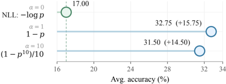
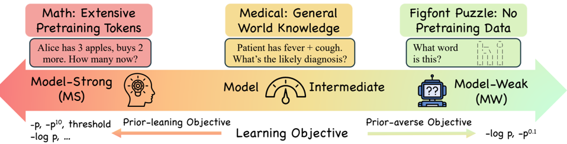

# beyond_loglik — Beyond Log Likelihood: Probability-Based Objectives for Supervised Fine-Tuning across the Model Capability Continuum

> **一句话重点 (TL;DR)**：SFT 默认用 NLL（−log p），但它在"从零训练分类"才最优；后训练时基座已有先验。本文把 NLL 推广成参数族 \(f_\alpha(p) = (1 - p^\alpha)/\alpha\)，并提出一个统一刻画——**模型能力连续谱**：基座先验强（如数学）时，**下调低概率 token 的 prior-leaning 目标**（如 −p）持续胜过 NLL；基座先验弱（如 figfont 谜题）时 NLL 主导；中间区两者难分。

**元信息**：arXiv:2510.00526v3（2026-05-22）｜ UIUC（共一 Gaotang Li、Ruizhong Qiu、Xiusi Chen；Heng Ji、Hanghang Tong）｜ **ICML 2026 Spotlight**（PMLR 306, 2026）｜ 主题：系统研究 SFT 训练目标（不再默认 NLL），**与 OPD/SFT 损失设计、token 加权高度相关**｜ 代码 https://github.com/GaotangLi/Beyond-Log-Likelihood ｜ 框架 VeRL（`main_verl`）。

---

## 关键图示

**① Motivation / 对比图**

*Figure 1. Motivating model-strong SFT result on math reasoning. For the objective family f α ( p ) = (1 -p α ) /α , where α → 0 recovers NLL ( -log p ). Prior-leaning objectives with α = 1 and α = 10 substantially improve average accuracy over NLL.*

**② 方法 / 架构图**

*Figure 2. The model capability continuum of SFT objectives in Post-Training. At the model-strong (MS) end, where base models already encode extensive priors (e.g., Llama 3 reports 25% math pretraining tokens (Grattafiori et al., 2024)), prior-leaning objectives that downweight low-probability tokens*

## 1. 相关工作与进展

- SFT 是 LLM 后训练标准做法，但**泛化常受限**，普遍归因于"模仿学习范式本身"。
- 从 RL 视角改 SFT 的一批工作：把 SFT/DPO 看作隐式 reward learning（小 lr + 散度目标）、把 importance sampling 引入 SFT、PPO-style clip 约束 drift、**均匀重加权梯度系数（Wu et al. 2026，等价于本文 −p 目标）**。
- 其他 SFT 损失：MSE、focal loss、Huber loss、entropic distribution matching 等——本文框架可统一解释为 prior-leaning。

## 2. 现有工作存在的问题

- 把 SFT 泛化差归咎于"模仿范式"，**忽略了默认目标 NLL 本身**。NLL 在从零训练小规模分类上经典最优，但后训练范式不同：基座已编码任务先验、监督序列长且可能含噪——**要求预训练模型逐 token 复刻冗长 CoT 会损害泛化**。
- 上述 RL 启发的改进各自在某些域有效，但**缺乏"何时用哪种目标"的统一刻画**。

## 3. Motivation
把 NLL 推广为参数族 \(f_\alpha(p) = (1 - p^\alpha)/\alpha\)（α→0 退化为 NLL；α=1 即 −p，对应最大化期望平均预测准确率）。实证发现 α=1、α=10 在数学上比 NLL 提升高达 **+15.75 / +14.50**（Fig.1）。由此系统性追问：何种场景适合 NLL、何种适合其他目标——**不主张单一万能损失**。

## 4. 主要灵感 / 核心直觉
一个目标对"correct logit"的梯度权重 \(W_f(p) = -f'(p) \cdot p \cdot (1 - p)\) 决定它强调哪类 token：

- **凸目标**（−log p）：W_f 峰值在 [0,0.5] → 强调**低概率 token**（prior-averse，先验排斥）。
- **凹目标**（−p、−p^10）：W_f 峰值在 [0.5,1] → 强调**高概率 token**（prior-leaning，先验倚靠）。
凸凹相当于"对模型先验尊重程度"的代理；f_α 族在 prior-averse↔prior-leaning 间平滑过渡。

## 5. 主要解决思路（一段话讲清核心）
把 SFT 目标统一写成 \(L_f = \mathbb{E}\!\left[f(p_\theta(y \mid x))\right]\)（f 可微非增）；用 W_f 的凸凹分析把各种损失归到 prior-leaning / prior-averse 两端；再提出**模型能力连续谱**：损失的好坏取决于基座先验强度——先验强用 prior-leaning，先验弱用 prior-averse（NLL），中间无单一最优。

## 6. 方法详解（通俗、分步骤）

- **统一框架**（§3）：Lemma 3.1 给出 correct-logit 梯度 = W_f(p)；Prop 3.2 证明凹目标的 W_f 峰值落 [0.5,1]、凸目标落 [0,0.5]。\(W_f(p) = p^\alpha (1 - p)\)：α→0 得 (1−p)（重低概率），α≥1 时低概率信号迅速衰减。
- **能力连续谱三段**：
  - **Model-Strong (MS)**（基座先验强，如数学）：prior-leaning（−p、阈值化 −log p·1{p≥0.2}）**持续优于** NLL。
  - **Model-Weak (MW)**（无相关预训练，如 figfont 谜题）：**NLL 主导**——逼模型从所有 token（尤其低概率/错误处）广泛学习。
  - **Model-Intermediate (MI)**（如医疗推理）：两者**难分伯仲**。
- **能力位置可量化**：用"训练集平均预测概率"——数学 0.76–0.81（Qwen2.5-Math-7B 0.81、LLaMA-3.1-8B 0.76）、医疗 ~0.50、figfont ~0.01。
- **理论**：梯度流下给出充分条件——MS 端 −p 损失下降更大、MW 端 NLL 更大。
- **消融工具**：hard-thresholding 变体 L_HT(I) 只在概率区间 I 内更新，隔离特定概率段 token 的贡献。

## 7. 实验数据集

- **8 个 backbone**：LLaMA-3.1-3B/8B、LLaMA-3.2-3B、DeepSeekMath-7B、Qwen2.5-Math-1.5B/7B、Qwen2.5-1.5B~32B、Qwen2.5-Coder-7B。
- **27 个 benchmark / 7 个域**。锚点域：MS 用 **NuminaMath**；MI 用 **m23k**（医疗）；MW 用 **Reasoning Gym figfont**。另含通用指令微调（AlpacaEval2 胜率）、编码、低资源多语。

## 8. 实验结果与主要发现

- **MS（数学，Table 1）**：−p 与阈值化 −log p 在所有模型/数据集上一致超 −log p。例：Qwen2.5-Math-1.5B 平均 17.00（NLL）→ 32.75（−p），+15.75。
- **MI（医疗，Table 2）**：−p 与 −log p 平均分几乎相同（差异在统计波动内）。
- **MW（figfont，Table 3）**：−log p 一致大幅超 −p（−p 的 Exact Match 常为 0）。
- **通用指令微调（Fig.4）**：固定数据/协议、只变 backbone 规模（3B→14B），偏好从 NLL 平滑转向 −p——同一设定内复现连续谱。
- 编码、低资源多语分别复现 MS 端（偏 −p）、MW 端（偏 NLL）。

## 9. 结果如何支撑其主张
主张"无单一最优损失，取决于基座能力"。支撑很强：三锚点域分别落到谱两端与中间且与理论一致；规模扫描在单一设定内复现转变；"训练集平均概率"作为能力代理与定性预期吻合（0.81/0.50/0.01）。多 backbone × 多 benchmark 的实证规模是其最大说服力来源。

## 10. 逻辑自洽性（中性评估）

- 高度自洽：W_f 凸凹分析 → 谱位置预测 → 实证三段，理论与实验互相印证，且把既有散点（−p 等价均匀重加权等）纳入同一谱系。
- 张力点：能力位置（训练集似然）需**事后估计**，并非先验可操作；MI 区"无单一最优"意味着实践指导有限。

## 11. 残留问题 / 局限

- **缺乏先验可操作的目标选择准则**：连续谱位置要训练后用训练集似然量化，落地时仍需试。
- **MI 区无定论**：在最常见的"中等先验"任务上反而给不出明确建议（作者称应转向数据/监督质量）。
- 提出的**不是新损失**，而是"何时用何损失"的认识论框架——价值在解释而非新算法。
- 与本项目 OPD 的关系：其"prior-leaning 下调低概率 token"思想与 token 加权/重要性采样工作相通，可指导 OPD/SFT 损失设计，但需注意 OPD 是 student-on-policy + teacher 分布监督，与本文的固定 ground-truth SFT 设定不同。

## 12. 开源代码与框架（链接+框架+代码可得性）

- 代码：https://github.com/GaotangLi/Beyond-Log-Likelihood 。
- 框架：**VeRL**（`main_verl`）。目录含 `scripts/{training,evaluation,ablation,one_click}`、`data`、`evaluations`，评测覆盖 27 benchmark。
- 代码可得性：固定数据/评测协议、仅改 SFT 目标（−log p / −p / 阈值化 −log p·1{p≥0.2}）即可复现；hard-thresholding 变体用于消融。
