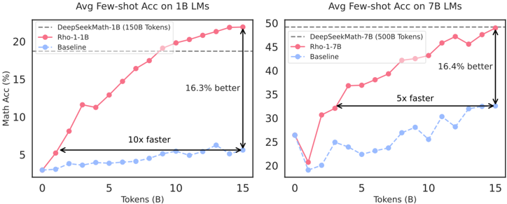
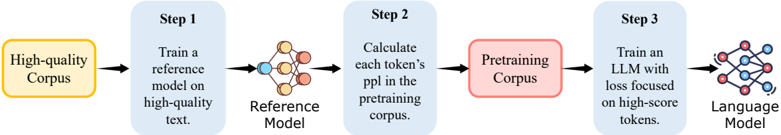

# rho1 — Rho-1: Not All Tokens Are What You Need

- **arXiv/链接**: arXiv:2404.07965v4 (https://arxiv.org/abs/2404.07965)
- **机构/作者**: 厦门大学 / 清华 / 上海AI Lab / Microsoft。Zhenghao Lin, Zhibin Gou(共一)等,Weizhu Chen 等
- **发表/时间**: NeurIPS 2024(Best Paper Runner-up);v4 2025-01-08
- **主题/相关性**: token 级数据选择 / 选择性预训练。提出 Selective Language Modeling(SLM):用参考模型给 token 打分,只在"高 excess loss"的有用 token 上算损失。**与 OPD/蒸馏中"token 级加权/选择"高度同源**——其"参考模型打分→选 token"机制,与 OPD 里"teacher 信号决定哪些 token 值得学"在思想上一致(rho1 用 excess loss = ref − train,可视为一种静态、离线的 token 级蒸馏信号),是 TSRD"教 path-selection、token 异质性"的经典先验工作。

## 关键图示

**① Motivation / 对比图**

*Figure 1: We continual pretrain 1B and 7B LMs with 15B OpenWebMath tokens. RHO-1 is trained with our proposed Selective Language Modeling (SLM), while baselines are trained using causal language modeling. SLM improves average few-shot accuracy on GSM8k and MATH by over 16%, achieving the baseline pe*

**② 方法 / 架构图**

*Figure 4: The pipeline of Selective Language Modeling (SLM). SLM optimizes language model performance by concentrating on valuable, clean tokens during pre-training. It involves three steps: (Step 1) Initially, train a reference model on high-quality data. (Step 2) Then, score each token's loss in a*

## 1. 开源代码链接

- https://github.com/microsoft/rho 〔已核-真实〕(README 标题/作者/HF 模型链接与论文一致;约 6.4MB,已 clone)。模型在 HF: microsoft/rho-math-1b/7b-v0.1 等。

## 2. 使用框架

- **重要更正(已核)**:官方 microsoft/rho 仓 **只发布模型权重 + 评测代码**——`rho-1/` 目录下仅含 `math-evaluation-harness`(git 子模块,本地克隆为空/未初始化)与复现输出 `outputs.zip`;README"Quick Start"只给 evaluation(`run_eval.sh cot/tora`)。**SLM 持续预训练/微调的训练代码并未开源**(社区需自行按论文实现 token-level excess-loss masking)。故 CloneTier 实质为"权重+评测仓",核心训练栈不可核。SLM 损失原理(对 top-k% excess-loss token 做 loss mask、其余流程同标准 CLM)以论文 §2/§3 为准。

## 3. 研究背景
LM 预训练惯例:对所有训练 token 统一施加 next-token 预测损失。数据过滤已成关键(文档级启发式/分类器),但即使经过严格文档级过滤,高质量语料在 **token 级**仍含噪声(幻觉、高度歧义、难预测 token)。

## 4. 当前存在的问题

- 文档级过滤粒度太粗:删 token 可能改变语义,过严过滤又丢有用数据并引入偏置。
- web 数据分布与下游理想分布不天然对齐。
- 对所有 token 同等施损失→在非关键 token 上浪费算力。
- token 级训练动态分析发现:显著 loss 下降只发生在一小撮 token 上;很多是已学会的"easy token",一些是 loss 波动、难收敛的"hard token",二者带来大量无效梯度更新。

## 5. Motivation
"语料中并非所有 token 对 LM 训练同等重要"。应聚焦于"与目标(理想)分布对齐的有用 token",把损失集中到真正有信息密度的 token(ρ = 信息密度,故名 Rho)。

## 6. 主要方法
**Selective Language Modeling (SLM)** 三步:

1. 在高质量语料上训练一个**参考模型(reference model)**,建立对齐目标分布的 token 效用度量。
2. 用参考模型对待训语料每个 token 用其 loss 打分。
3. 训练目标模型时,只在"参考模型与训练模型之间 **excess loss**(差值)较高"的 token 上算损失(输入完整序列、选择性 mask 掉不需要的 token 的 loss),即选择性学习最利于下游的 token。

## 7. 实验数据集

- 数学持续预训练:**15B OpenWebMath** 语料;评测 9 个数学任务(含 GSM8K、MATH)。
- 微调后:MATH 数据集 SOTA(Rho-1-1B 40.6%、7B 51.8%,仅用 DeepSeekMath 3% 的预训练 token 量)。
- 通用持续预训练:**80B 通用 token**;15 个多样任务平均 +6.8%。

## 8. 怎么做的(训练/数据/流程)
先用高质量小语料训 reference model;再对大语料逐 token 打分;持续预训练时按 excess-loss 选 token、只反传选中 token 的损失(token-level loss masking),其余流程同标准 CLM。

- **结果**:15B OpenWebMath 持续预训练下数学 few-shot 精度绝对提升最高 +30%(9 任务);达到 baseline 性能快 5–10×(token 效率显著)。
- 〔评注/局限〕(1)SLM 的 token 选择是**静态、离线**的(参考模型一次性打分),与在线策略蒸馏(OPD)里 teacher 随 student 演化的动态信号不同——迁移到 OPD 时这是关键差异点;(2)依赖一个"对齐目标分布"的高质量参考模型,该参考模型质量直接决定 token 选择质量,存在循环依赖;(3)excess-loss 选择本质是"选 student 还学不好但 ref 学得好"的 token,与 OPD/distill 中"匹配 teacher 分布"目标相近但非同一;(4)工作面向**预训练/持续预训练**,非推理后训练 RL,定位需区分。
