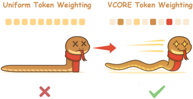
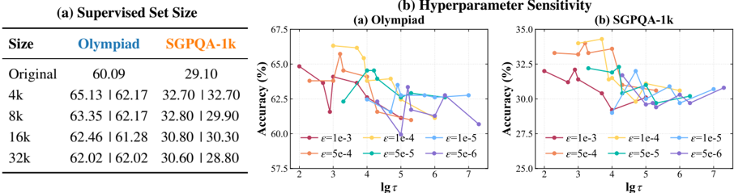

# vcore — VCORE: Variance-Controlled Optimization-based Reweighting for Chain-of-Thought Supervision

> **一句话重点 (TL;DR)**：把长 CoT SFT 的 token 加权形式化为"单步 SGD 下使期望 loss 下降最大、且加权分布与均匀分布 KL ≤ δ"的约束优化，闭式解为 Gibbs 分布 q\*∝exp(τ·gradient-utility)，配一个 one-backward 探针估 utility + 方差控制系数 α 稳训练；不依赖 teacher 引导/置信阈值/熵过滤，在中小模型与综合均值上稳定优于 SFT/DFT/iw-SFT。

**元信息**：arXiv 2510.27462（v1 2025-10，v2 2026-04-18，cs.CL）｜ 上海交通大学 & 香港中文大学（深圳）（Xuan Gong、Senmiao Wang、Hanbo Huang、Ruoyu Sun、Shiyu Liang 通讯）｜ ACL 2026 Main ｜ 主题 长 CoT SFT 阶段 token 级 loss reweighting（与 DFT/iw-SFT 同类），与本项目蒸馏/OPD 的 token 加权/credit assignment 直接相关，但路线是"从训练信号自身导权重"、无需 teacher 引导 ｜ 代码 https://github.com/coder-gx/VCORE （已 clone ~219MB，含 LLaMA-Factory + 改过的 transformers-4.52.4 + paper_pdf）｜ 框架 LLaMA-Factory + 定制 transformers 4.52.4

## 关键图示

**① Motivation / 对比图**

*Figure 1: Overview of VCORE. Compared to the standard cross-entropy loss, VCORE approaches long-CoT SFT from an optimization perspective and adjusts token weights according to their gradient utility, thereby enabling more effective use of supervision signals and improving generalization.*

**② 方法 / 架构图**

*Figure 2: Component Analysis and Ablation. (a) Impact of supervised set size on in-domain (Olympiad) and out-of-domain (SGPQA-1k) accuracy for VCORE|DFT ; (b) Hyperparameters: reweighting temperature τ and probing scale ϵ . All results use Qwen3-4B. Metrics are accuracy (%) on Olympiad (in-domain) a*

## 1. 相关工作与进展
- **SFT for reasoning**：长 CoT SFT（从 teacher 蒸馏推理迹）是轻量有效路线，常作后续 RL 初始化；但多数工作重工程与数据配方，**优化算法层留白**。
- **SFT 中的 token reweighting**：DFT（Wu 2025）把标准 SFT 重解读为含隐式 1/π_θ 重要性因子的 policy-gradient，过度加权低概率 token，故乘上模型对目标 token 的概率来纠正；iw-SFT（Qin&Springenberg 2025）证 curated 数据上 SFT 优化某 RL 目标下界，按相对参考/当前策略的重要性加权 log-likelihood 收紧界。二者均 **RL-motivated**。VCORE 区别：**optimization-driven**，从单步 SGD 一阶下降动力学直接导权重 + 显式方差控制。

## 2. 现有工作存在的问题
均匀加权（标准交叉熵对所有 token 等权）两大缺陷：(1) 并非所有 token 都值得学——很多 next-token 预测要么过易要么过歧义，梯度学习价值低、浪费更新拖慢收敛；(2) 自动蒸馏的 CoT（动辄 >1k token）常含幻觉/错位的 spurious token，均匀加权让噪声主导梯度、损害泛化。已有 reweighting（DFT/iw-SFT）依赖 1/π_θ 或 RL 目标下界的重要性加权，而非直接从训练时梯度信息出发。

## 3. Motivation
中心问题：能否用**优化驱动**而非启发式的方式给 token 加权？把 token 加权形式化为"在单步 SGD 下使期望 loss 下降最大、且加权分布 q 与均匀分布 u 的 KL(q‖u)≤δ"的约束优化，从一阶下降动力学直接导出权重，不依赖 teacher 引导、置信度阈值或熵过滤。

## 4. 主要灵感 / 核心直觉
"信用分配=梯度该去哪"。把 token 的价值定义为其梯度与全局下降方向的对齐度（gradient utility s_t=⟨∇L,∇ℓ_t⟩）——对齐度高的 token 最能降总 loss、应优先；约束 KL(q‖u)≤δ 防过度集中致不稳。这样既不靠 teacher/熵/阈值等启发式，又把"哪些 token 重要"直接从训练信号读出。

## 5. 主要解决思路(一段话讲清核心)
对每条轨迹：(1) 一阶 Taylor 展开期望 loss 下降，定义 token 梯度效用 s_t=⟨∇L,∇ℓ_t⟩；(2) 在单纯形上 max Σq(t)s_t s.t. KL(q‖u)≤δ，闭式解 Gibbs 分布 q\*(t)∝exp(τ s_t)（τ→0 退均匀、τ→∞ 集中最高效用）；(3) 用 one-backward 探针无偏估 s_t；(4) 乘方差控制系数 α=√(V_u/V_q) 把重加权更新方差对齐到均匀加权方差。

## 6. 方法详解(通俗、分步骤)
- **最优加权（Gibbs，§4.1）**：对 loss 一阶 Taylor，L(θ+)−L(θ)=−η Σ q_t s_t + O(η²)，s_t=⟨∇L,∇ℓ_t⟩；约束优化闭式解 q\*(t)=exp(τs_t)/Σ_j exp(τs_j)。
- **One-backward probing trick（关键效率点）**：朴素估 s_t 需每 token 一次 backward（长序列不可行）。VCORE 另抽 mini-batch B' 算均匀权下降方向 ∇L_{B'}(θ;u)，沿该方向做小扰动 ϵ 测 token loss 变化 lim_{ϵ→0}[ℓ_t(θ)−ℓ_t(θ−ϵ∇L_{B'})]/ϵ = s_t（无偏）——仅 1 次 backward + 1 次 forward 覆盖全部 |y| token，无二阶梯度/hook。
- **Variance-Controlled 缩放（§4.2）**：Gibbs 重加权改变更新方差 V_q；引入 α=√(V_u/V_q)（V_u 为均匀权方差），把重加权更新方差对齐到均匀加权（q 越尖/序列越长 α 越小以稳训练，q 平衡时 α≈1）；无额外架构改动。
- **Algorithm 1**：每 batch 抽 B'→算均匀下降方向→估 s_t→得 q\*→算 α→θ←θ−η E_{(x,y),t~q\*}[∇(α·ℓ_t)]。

## 7. 实验数据集
- 训练（仅留 DeepSeek-R1 生成、过滤正确性的 CoT）：数学 OpenMathReasoning，代码 OpenCodeReasoning 的 C++ 子集；Qwen3 每域 3.2k（math CoT 均长 3155、code 2861），LLaMA 每域 32k。
- 评测——In-domain：AIME(24+25)、OlympiadBench-math（math），LiveCodeBench v6、OJBench（code）；Out-of-domain：R-Bench-T、SuperGPQA-1k。基座 Qwen3-{4,8,32}B、LLaMA-3.1-8B-Instruct（弱模型补充：Qwen3-1.7B、Mistral-7B-Instruct-v0.3）。指标 Pass@1（greedy，max_gen 8192），vLLM v1。

## 8. 实验结果与主要发现
- **主结果（Table 1）平均分**：VCORE **31.03** > DFT 29.99 > SFT 28.97 > Random 28.78 > iw-SFT 28.35（ID/OOD "Avg." 列在四模型上的平均）。
- **中小模型增益更明显**：LLaMA-3.1-8B ID/OOD 从 DFT 的 5.54/7.17 升到 11.38/9.59；Qwen3-4B 从 32.49/32.49 升到 36.09/32.87；弱模型表（Table 2）Qwen3-1.7B Olympiad 53.41→55.64、Mistral-7B Olympiad 3.41→9.94。规模 8B→32B 相对 base 增益由 +4.12 升到 +4.70。
- **并非全面碾压**：Qwen3-8B 上 VCORE OOD-avg 35.26 不及 DFT 37.29；Qwen3-32B 上 VCORE 45.93 < DFT 49.57——大模型上 DFT 更强，VCORE 优势集中在 ID/OOD 综合平均与中小模型（作者归因：VCORE 按 population loss 重加权，模型已强或 CoT 与目标失配时增益有限）。
- 组件/鲁棒：方差控制必要（Fig.3 无 scaling 时 loss 频繁尖峰、有 scaling 平滑收敛）；对 τ/ϵ（Fig.2b）、batch size/lr（Table 3）鲁棒；训练集 4k→32k 上稳定优于 DFT（Fig.2a，但大集略降因质量/风格混杂）。
- **作为 RL 初始化（Obs 7，Table 4）**：Qwen3-4B/8B 用 VCORE 初始化后 GRPO 200 步，RL 后均超 DFT（即便 RL 前略低）；推测 DFT 降生成熵限制 RL 探索。
- **简单任务退化（Obs 8，Table 5）**：长 CoT SFT 在 GSM8K（短链）略降、在 MATH500（深链）升——长 CoT 监督主要利于推理密集任务。

## 9. 结果如何支撑其主张
- "optimization-driven 优于启发式"：综合均值 VCORE > DFT/iw-SFT 支撑核心主张，且消融把增益拆给 Gibbs 加权 + 方差控制。
- "方差控制必要"：Fig.3 有/无 scaling 的 loss 曲线对比直接验证。
- "更好 RL 初始化"：Table 4 RL 后 VCORE > DFT（尽管 RL 前略低）支撑"更高 RL 天花板"。
- "鲁棒性"：τ/ϵ（Fig.2b）、bs/lr（Table 3）、训练集规模（Fig.2a）多组消融支撑超参不敏感。

## 10. 逻辑自洽性(中性评估)
理论链条自洽：约束优化 → Gibbs 闭式解 → one-backward 无偏估计 → 方差对齐，且诚实报告了"非全面碾压""简单任务退化""大模型不及 DFT"等反例。两处需留意的假设张力：(1) 理论建立在单步一阶 Taylor + SGD 假设，实际用 AdamW，二者一致性未严格讨论；(2) one-backward trick 依赖额外 batch B' 的一次前/后向，实际每步成本约翻倍，论文未给端到端 wall-clock 开销对比。"strongest overall" 的措辞需结合"优势主要在综合均值/中小模型、大模型 DFT 更强"这一细节理解。

## 11. 残留问题 / 局限
- 全程仅 LoRA（Qwen3 rank8/lr2e-5、LLaMA rank64/lr2e-4，alpha=2×rank，1 epoch），未做全参 SFT 验证；max_gen 限 8192 对长 CoT 推理可能偏短。
- 训练语料仅 OpenMathReasoning + OpenCodeReasoning（均 DeepSeek 蒸馏），未探更多样数据/其它 reasoning 模型生成的 CoT（作者自陈）。
- 潜在失效模式：reweighting 可能过度强调泄露最终答案的 spurious 模式、放大数据集 artifact/标注偏置（作者自陈，建议加 dropout masking / answer prefix control 正则）。
- τ/ϵ 需逐模型调（虽鲁棒但有量级敏感性，Fig.2b）；one-backward 每步成本约翻倍但无端到端计时。

## 12. 开源代码与框架(链接+框架+代码可得性)
- 仓库 https://github.com/coder-gx/VCORE （已 clone ~219MB），含基于 **LLaMA-Factory** 的 `llama_factory/`、定制 `transformers-4.52.4`、`figures/`、`data/`、`examples/`、`docker/`，以及仓库内 `paper_pdf/ACL_ARR_OCT_preprint.pdf`。
- 框架：LLaMA-Factory（Zheng 2024）+ 定制 transformers 4.52.4；训练 LoRA + AdamW + cosine，推理 vLLM v1；硬件 4×RTX PRO 6000 Blackwell。
- 代码可得性：完整训练栈 + 论文 PDF 内置，VCORE 的 Gibbs 加权 + one-backward 探针 + 方差控制实现于定制 transformers 训练循环中（reweighting 介入 SFT 阶段 loss）。可得性高。
